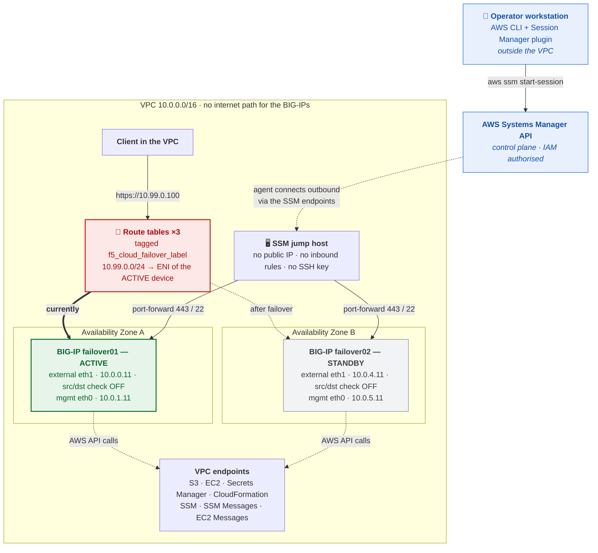
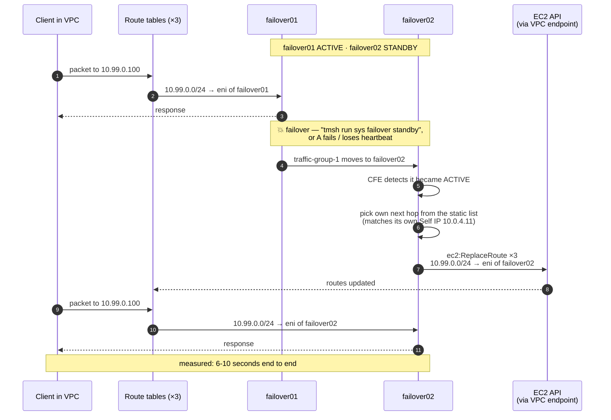
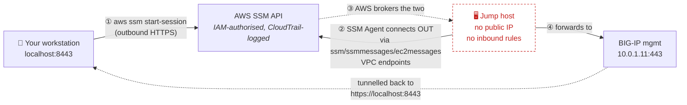

# Air-gap BIG-IP failover in AWS GovCloud — deployment guide

A complete, first-time-operator walkthrough for deploying an active/standby BIG-IP pair
into AWS GovCloud with **no public IP addresses anywhere**, and an application VIP that
fails over between Availability Zones **without an Elastic IP**.

This is the companion to [`examples/failover/GOVCLOUD-GUIDE.md`](../failover/GOVCLOUD-GUIDE.md).
That guide covers the shared GovCloud groundwork — the staging bucket, the admin secret,
the key pair, the image lookup and the clustering self-heal — and everything in it still
applies. This guide is self-contained for deployment, and covers what this template does
differently.

> ### ✅ Lab-validated
> Deployed and failover-tested end to end in `us-gov-east-1` on **2026-09-08**, on the
> 3-NIC PAYG BIG-IP 17.5.1.6 pair. VIP failover was verified in **both** directions across
> several runs and converged in **6-10 seconds**. Quote **10 seconds** to a customer for
> headroom. See [section 8](#8-testing-failover) for the method and the raw numbers.

---

## Contents

1. [What you are deploying](#1-what-you-are-deploying)
2. [How the VIP fails over](#2-how-the-vip-fails-over)
3. [Before you start](#3-before-you-start)
4. [Step-by-step deployment](#4-step-by-step-deployment)
5. [Getting into the BIG-IPs with Session Manager](#5-getting-into-the-big-ips-with-session-manager)
6. [Validating the deployment](#6-validating-the-deployment)
7. [Seeing it work in a browser](#7-seeing-it-work-in-a-browser)
8. [Testing failover](#8-testing-failover)
9. [What to plan for](#9-what-to-plan-for)
10. [Troubleshooting](#10-troubleshooting)

---

## 1. What you are deploying

Two BIG-IP Virtual Editions in an active/standby pair, one in each of two Availability
Zones, plus a small jump host for management access. Nothing in the VPC has a public IP
address, and every AWS API call the BIG-IPs make is served by a VPC endpoint inside the
VPC rather than over the internet.



**What makes the air gap real.** The private subnets have **no default route** — no NAT
gateway, no Elastic IP, no path to the internet at all. Everything the solution needs is
reachable without one:

| Dependency | How it is served with no egress |
|---|---|
| Templates, runtime-init installer, extension RPMs, WAF policy | **S3 gateway endpoint**, attached to the private route tables |
| EC2, Secrets Manager, CloudFormation, Systems Manager APIs | **Interface endpoints** with private DNS |
| DNS | **`169.254.169.253`** — the link-local VPC resolver |
| NTP | **`169.254.169.123`** — Amazon Time Sync, link-local |

> ⚠️ **Anything you add that expects internet egress will fail**, including
> `provisionExampleApp='true'`, which pulls a container image. If you need egress, set
> `provisionNatGateways` back to `true` in the `Network` stack parameters — and accept that
> it reintroduces two Elastic IPs and a route out of the BIG-IP management and internal
> subnets, which an assessor will find.

**The moving pieces:**

| Piece | What it is | Why it is here |
|---|---|---|
| **BIG-IP pair** | Two VEs, 3 NICs each (management, external, internal), clustered active/standby | The HA pair serving your application |
| **Application VIP** `10.99.0.100` | An address **outside the VPC CIDR** | It belongs to no subnet, so it can be routed to either AZ — this is the whole trick |
| **Route tables** | Three, each with a route for `10.99.0.0/24` and tagged `f5_cloud_failover_label` | How clients reach the VIP, and what moves on failover |
| **Cloud Failover Extension (CFE)** | An F5 extension running on each BIG-IP | On failover it calls `ec2:ReplaceRoute` to re-point those routes |
| **Declarative Onboarding (DO)** | F5 extension | Builds the cluster, VLANs and Self IPs at first boot |
| **Application Services (AS3)** | F5 extension | Creates the virtual server bound to the VIP |
| **BIG-IP Runtime Init** | F5 bootstrapper | Downloads and applies DO/AS3/CFE from your S3 bucket at boot |
| **SSM jump host** | Amazon Linux 2023, `t3.micro` | The only way in. BIG-IP cannot run the SSM Agent, so this hop exists |
| **VPC endpoints** | S3, EC2, Secrets Manager, CloudFormation, SSM ×3 | Let the BIG-IPs and jump host reach AWS APIs with no internet |

---

## 2. How the VIP fails over

### Why the standard template cannot do this

In the EIP-based [`examples/failover`](../failover/README.md) solution, each BIG-IP is in
its own AZ, so its own subnet. The VIP is a **secondary private IP** on each device's
external interface:

| BIG-IP | AZ | External subnet | Self IP | VIP (secondary) |
|---|---|---|---|---|
| failover01 | A | `10.0.0.0/24` | `10.0.0.11` | `10.0.0.101` |
| failover02 | B | `10.0.4.0/24` | `10.0.4.11` | `10.0.4.101` |

A secondary private IP must belong to its subnet's CIDR. AWS will not assign `10.0.0.101`
to an interface in `10.0.4.0/24`, so those are two independent addresses and the only
thing CFE can move between them is an **Elastic IP association**.

Remove the Elastic IP — as an air-gapped deployment must — and CFE has nothing to
relocate. The stack deploys, the cluster forms, `cloud-failover/inspect` looks healthy,
and **the VIP silently never moves**. That is the problem this template solves.

### What this template does instead

The VIP is an address outside the VPC CIDR, so AWS has no implicit route for it. The
template creates one in every route table, pointing at the active BIG-IP's external
interface. On failover, CFE re-points them.



The client never changes the address it is talking to. No addressing changes anywhere —
just three API calls.

### Five things must line up

The template does all five for you; they are listed so you know what to check if
something is wrong.

| # | Requirement | Where it happens |
|---|---|---|
| 1 | A route for the VIP prefix in every route table clients use | `VipRoutePublic`, `VipRoutePrivateA`, `VipRoutePrivateB` in `failover-airgap.yaml` |
| 2 | Route tables tagged so CFE can **find** them and IAM **allows** the write | `modules/network` parameter `routeTableFailoverTag` (set to `cfeTag`) |
| 3 | Source/destination checking **off** on both external interfaces | `modules/bigip-standalone` parameter `disableSourceDestCheck` |
| 4 | `failoverRoutes` in the CFE declaration, with **bare** Self IPs as next hops | `bigip-configurations/runtime-init-conf-*-airgap.yaml` |
| 5 | An AS3 virtual server bound to the VIP address | same files, `Service_Address_01` |

> **Why "source/destination check off" matters.** AWS normally drops any packet arriving
> at an interface that is not addressed to that interface. The VIP is not one of the
> BIG-IP's own addresses, so without this the traffic is discarded before BIG-IP ever
> sees it. The template disables it on the interface resource itself, so it survives
> reboots.

> **Why "bare" Self IPs matters.** CFE matches the next-hop list against each device's own
> addresses to decide which hop is its own. An entry with a mask (`10.0.0.11/24`) never
> matches a bare address (`10.0.0.11`), and the device that fails to match performs **zero**
> route operations while still reporting success. This was a real bug, found in lab on
> 2026-09-08 and fixed; see [troubleshooting](#failover-succeeds-but-the-route-never-moves).

---

## 3. Before you start

### 3.1 On the AWS side

- **An AWS GovCloud account** with permission to create VPCs, EC2 instances, IAM roles
  (`CAPABILITY_NAMED_IAM`), S3 buckets, Secrets Manager secrets and VPC endpoints.
- **One Region, used consistently.** Pick `us-gov-east-1` or `us-gov-west-1` and use it
  for the stack, the S3 bucket, the key pair and the secret. VPC endpoints are regional —
  an endpoint in one Region cannot reach a bucket in another, so a cross-Region setup
  breaks the air gap even if it appears to work.
- **A subscription to the BIG-IP marketplace image** for your Region.
- **A staging S3 bucket** holding the templates and BIG-IP artifacts (step 4.4).

### 3.2 On your workstation

- **A clone of this repository.** You run `aws s3 sync` from its root.
- **The AWS CLI v2**, configured for your GovCloud account.
- **Python 3** — used only to pretty-print JSON in the verification commands.
- **The AWS Session Manager plugin.** This is a *separate install* from the AWS CLI and is
  the single most commonly missed prerequisite. Without it, `aws ssm start-session` fails
  with `SessionManagerPlugin is not found` and you cannot reach the BIG-IPs at all.

<details>
<summary><b>Installing the Session Manager plugin</b> (click to expand)</summary>

**macOS — with Homebrew (easiest):**

```bash
brew install --cask session-manager-plugin
```

**macOS — official installer.** Check your chip first with `uname -m`:

```bash
cd /tmp
# Apple Silicon (arm64)
curl -o sessionmanager-bundle.zip \
  "https://s3.amazonaws.com/session-manager-downloads/plugin/latest/mac_arm64/sessionmanager-bundle.zip"
# Intel (x86_64) — use this URL instead
# curl -o sessionmanager-bundle.zip \
#   "https://s3.amazonaws.com/session-manager-downloads/plugin/latest/mac/sessionmanager-bundle.zip"

unzip -o sessionmanager-bundle.zip
sudo ./sessionmanager-bundle/install \
  -i /usr/local/sessionmanagerplugin -b /usr/local/bin/session-manager-plugin
```

**Linux (RPM):**

```bash
curl -o session-manager-plugin.rpm \
  "https://s3.amazonaws.com/session-manager-downloads/plugin/latest/linux_64bit/session-manager-plugin.rpm"
sudo yum install -y session-manager-plugin.rpm
```

**Linux (Debian/Ubuntu):**

```bash
curl -o session-manager-plugin.deb \
  "https://s3.amazonaws.com/session-manager-downloads/plugin/latest/ubuntu_64bit/session-manager-plugin.deb"
sudo dpkg -i session-manager-plugin.deb
```

**Windows:** download and run the installer from
[AWS's documentation](https://docs.aws.amazon.com/systems-manager/latest/userguide/session-manager-working-with-install-plugin.html).

**Verify — on any platform:**

```bash
hash -r          # zsh/bash cache command paths; this makes the shell notice the new binary
session-manager-plugin
# → "The Session Manager plugin was installed successfully. Use the AWS CLI to start a session."
```

</details>

- **IAM permission to start sessions.** Your identity needs `ssm:StartSession` on the jump
  instance and on the `AWS-StartPortForwardingSessionToRemoteHost` document.
- **Reachability of the AWS API.** Session Manager works by your workstation talking to the
  AWS *control plane*, not to the VPC. If you can run `aws cloudformation describe-stacks`,
  you are fine. In a fully disconnected enclave with no AWS API access at all, Session
  Manager cannot help and you would need private connectivity (Direct Connect/VPN) instead.

### 3.3 Choosing your VIP prefix

`externalVipCidr` (default `10.99.0.0/24`) and `externalVipAddress` (default
`10.99.0.100`) need thought before you deploy:

- The prefix **must not overlap** the VPC CIDR, any peered VPC, or any on-premises range
  reachable over Direct Connect, VPN or Transit Gateway. It is routed *inside* this VPC,
  so a collision black-holes real traffic.
- The address must be **inside** the prefix.
- The **same prefix** is used for the route and for CFE's scoping range. CFE's prefix
  matching is exact — do not route a `/32` and scope a `/24`.

---

## 4. Step-by-step deployment

### 4.1 Set your variables

Everything below uses these. Set them once per terminal session.

```bash
REGION=us-gov-east-1
BUCKET=f5-cft-gov                                   # must be globally unique
PREFIX=f5-aws-cloudformation-v2/v3.6.0.0/examples
STACK=failover-airgap
```

> **zsh users:** zsh does not word-split unquoted variables the way bash does. Where a
> command below takes a *list* (several route table IDs, for example), the IDs are written
> out literally rather than passed through one variable. If you build your own, use a zsh
> array — `RTBS=(rtb-aaa rtb-bbb)` — not `RTBS="rtb-aaa rtb-bbb"`.

### 4.2 Create the admin password secret

The BIG-IPs read their admin password from AWS Secrets Manager at boot. Both devices use
the **same** secret — that shared credential is also what lets them establish device trust
with each other.

```bash
aws secretsmanager create-secret --region "$REGION" \
  --name f5-bigip-admin-password \
  --secret-string 'CHANGE-ME-to-a-strong-password'

# Note the ARN it returns — you need it in step 4.6
aws secretsmanager list-secrets --region "$REGION" \
  --query 'SecretList[].[Name,ARN]' --output table
```

### 4.3 Create an SSH key pair

```bash
aws ec2 create-key-pair --region "$REGION" --key-name f5-airgap-key \
  --query 'KeyMaterial' --output text > ~/.ssh/f5-airgap-key.pem
chmod 400 ~/.ssh/f5-airgap-key.pem
```

You pass the key pair **name** (`f5-airgap-key`), not the file path.

### 4.4 Stage the S3 bucket

The BIG-IPs and CloudFormation both read everything from this bucket. There are two kinds
of object, and they get there differently:

- **Templates** (`modules/**`, `failover-airgap/**`) — copied by `aws s3 sync` from this repo.
- **BIG-IP artifacts** — the runtime-init installer and three extension RPMs. These are
  **not in the repo** and `s3 sync` will not copy them. Download and `cp` them separately.

**Download the artifacts** (once, from a machine with internet):

```bash
curl -fL -o f5-bigip-runtime-init-2.0.3-1.gz.run \
  https://github.com/F5Networks/f5-bigip-runtime-init/releases/download/2.0.3/f5-bigip-runtime-init-2.0.3-1.gz.run
curl -fL -o f5-declarative-onboarding-1.47.0-14.noarch.rpm \
  https://github.com/F5Networks/f5-declarative-onboarding/releases/download/v1.47.0/f5-declarative-onboarding-1.47.0-14.noarch.rpm
curl -fL -o f5-appsvcs-3.56.0-10.noarch.rpm \
  https://github.com/F5Networks/f5-appsvcs-extension/releases/download/v3.56.0/f5-appsvcs-3.56.0-10.noarch.rpm
curl -fL -o f5-cloud-failover-2.4.0-0.noarch.rpm \
  https://github.com/F5Networks/f5-cloud-failover-extension/releases/download/v2.4.0/f5-cloud-failover-2.4.0-0.noarch.rpm
```

> The RPM versions above match the `extensionHash` values pinned in the runtime-init
> config files, which the BIG-IP enforces at install time. If you change a version, update
> its `extensionVersion` and `extensionHash` too.

**Create the bucket and upload** (run `s3 sync` from the repository root):

```bash
aws s3api create-bucket --bucket "$BUCKET" --region "$REGION" \
  --create-bucket-configuration LocationConstraint="$REGION"

aws s3 sync ./examples/ "s3://$BUCKET/$PREFIX/" --region "$REGION"

aws s3 cp f5-bigip-runtime-init-2.0.3-1.gz.run           "s3://$BUCKET/$PREFIX/" --region "$REGION"
aws s3 cp f5-declarative-onboarding-1.47.0-14.noarch.rpm "s3://$BUCKET/$PREFIX/bigip-extensions/" --region "$REGION"
aws s3 cp f5-appsvcs-3.56.0-10.noarch.rpm                "s3://$BUCKET/$PREFIX/bigip-extensions/" --region "$REGION"
aws s3 cp f5-cloud-failover-2.4.0-0.noarch.rpm           "s3://$BUCKET/$PREFIX/bigip-extensions/" --region "$REGION"
```

> ⚠️ **Never add `--delete` to that sync.** The installer and RPMs live only in the bucket,
> not in the repo, so `--delete` would remove them and every BIG-IP would fail to onboard.

**If you are updating an existing bucket**, the same `s3 sync` is all you need — it is
idempotent and uploads only what changed. Re-run it after *any* local edit to a template
or runtime-init file: the BIG-IPs read the bucket copy, not your working tree. A stale
bucket is the single most confusing failure mode, because the stack deploys perfectly and
the BIG-IPs quietly use the old configuration.

### 4.5 Make the artifacts readable (required)

CloudFormation fetches the nested *templates* using your IAM credentials, so a private
bucket is fine for those. But each **BIG-IP downloads the installer, its runtime-init
config and the RPMs at boot using unauthenticated HTTPS** — no AWS signature. If those
objects are not anonymously readable the BIG-IP gets HTTP 403, runtime-init never
installs, nothing is configured, and the stack rolls back, often with no obvious error.

GovCloud enables Block Public Access and disables ACLs by default, so you grant read with
a bucket policy. Clearing Block Public Access alone grants nothing.

```bash
aws s3api put-public-access-block --bucket "$BUCKET" \
  --public-access-block-configuration \
    BlockPublicAcls=true,IgnorePublicAcls=true,BlockPublicPolicy=false,RestrictPublicBuckets=false

cat > /tmp/bucket-policy.json <<EOF
{
  "Version": "2012-10-17",
  "Statement": [
    {
      "Sid": "PublicReadGetObject",
      "Effect": "Allow",
      "Principal": "*",
      "Action": "s3:GetObject",
      "Resource": "arn:aws-us-gov:s3:::${BUCKET}/*"
    },
    {
      "Sid": "DenyInsecureTransport",
      "Effect": "Deny",
      "Principal": "*",
      "Action": "s3:*",
      "Resource": [
        "arn:aws-us-gov:s3:::${BUCKET}",
        "arn:aws-us-gov:s3:::${BUCKET}/*"
      ],
      "Condition": { "Bool": { "aws:SecureTransport": "false" } }
    }
  ]
}
EOF

aws s3api put-bucket-policy --bucket "$BUCKET" --policy file:///tmp/bucket-policy.json
```

Grant `s3:GetObject` only — never `PutObject` or `DeleteObject` to `Principal: "*"`.
`s3:ListBucket` is deliberately omitted so the bucket cannot be enumerated. If you know
your consumer account IDs, scope `Principal` to those instead of `"*"`.

If your security posture forbids any public-read bucket, see the
[air-gapped alternatives](../failover/GOVCLOUD-GUIDE.md#air-gapped--cannot-make-public-alternatives)
in the GovCloud guide — IAM-signed pulls, pre-signed URLs, or baking artifacts into a
custom image.

**Verify every object the BIG-IP needs. All must return `200`:**

```bash
for KEY in \
  "${PREFIX}/failover-airgap/failover-airgap.yaml" \
  "${PREFIX}/failover-airgap/bigip-configurations/runtime-init-conf-3nic-payg-instance01-airgap.yaml" \
  "${PREFIX}/failover-airgap/bigip-configurations/runtime-init-conf-3nic-payg-instance02-airgap.yaml" \
  "${PREFIX}/modules/ssm-jump/ssm-jump.yaml" \
  "${PREFIX}/modules/network/network.yaml" \
  "${PREFIX}/modules/bigip-standalone/bigip-standalone.yaml" \
  "${PREFIX}/f5-bigip-runtime-init-2.0.3-1.gz.run" \
  "${PREFIX}/bigip-extensions/f5-declarative-onboarding-1.47.0-14.noarch.rpm" \
  "${PREFIX}/bigip-extensions/f5-appsvcs-3.56.0-10.noarch.rpm" \
  "${PREFIX}/bigip-extensions/f5-cloud-failover-2.4.0-0.noarch.rpm" \
  "${PREFIX}/autoscale/bigip-configurations/Rapid_Deployment_Policy_13_1.xml"; do
  printf '%s  %s\n' \
    "$(curl -sk -o /dev/null -w '%{http_code}' "https://${BUCKET}.s3.${REGION}.amazonaws.com/${KEY}")" "$KEY"
done
```

`403` means the policy or Block Public Access setting has not taken effect. `404` on the
`.run` or an `.rpm` means it was never uploaded — it is not part of `s3 sync`.

### 4.6 Pre-flight checks

Two lookups that fail *cheaply* now instead of expensively mid-deploy.

**The jump host image.** The jump host resolves its AMI from an AWS-published SSM
parameter. If that parameter is not present in your Region, the nested stack fails at
create time:

```bash
aws ssm get-parameter --region "$REGION" \
  --name /aws/service/ami-amazon-linux-latest/al2023-ami-kernel-default-x86_64 \
  --query 'Parameter.Value' --output text
```

An AMI ID means you are fine. An error means you must pass your own image as
`ssmJumpCustomImageId` — any AMI works provided the SSM Agent is installed and starts at
boot (Amazon Linux 2 and 2023 both do, as do most hardened AL2023 builds).

**The BIG-IP image.** The template looks up the BIG-IP AMI by name pattern, and
availability differs by Region:

```bash
aws ec2 describe-images --region "$REGION" --owners aws-marketplace \
  --filters "Name=name,Values=*17.5.1.6-0.0.25*PAYG-Best Plus 25Mbps*" \
  --query 'reverse(sort_by(Images,&CreationDate))[].[Name,ImageId,CreationDate]' --output table
```

An empty result means the pinned default is not in your Region — find one that is, and set
`bigIpImage` to a pattern pinned to that version and build with the trailing timestamp
wildcarded, e.g. `*17.5.1.6-0.0.25*PAYG-Best Plus 25Mbps*`.

> ⚠️ **Use a "Best" image.** The onboarding declaration provisions ASM and the AS3
> declaration attaches a WAF policy. ASM exists only in the **Best** bundle — a "Good" or
> "Better" image onboards partway and then fails.

### 4.7 Fill in the parameters

Edit `examples/failover-airgap/failover-airgap-parameters.json`. Four values are genuinely
required:

| Parameter | Value |
|---|---|
| `bigIpSecretArn` | The full secret ARN from step 4.2 |
| `sshKey` | The key pair **name** from step 4.3 (e.g. `f5-airgap-key`) |
| `restrictedSrcAddressMgmt` | Source CIDR allowed to reach BIG-IP management |
| `restrictedSrcAddressApp` | Source CIDR allowed to reach the application |

Also confirm `s3BucketName` and `s3BucketRegion` match your bucket and Region.

> The security groups already permit the VPC CIDR on management (22, 443) and on the
> application (80, 443), so the jump host and in-VPC clients work regardless of what you
> put in `restrictedSrcAddress*`. Those two parameters control access from **outside** the
> VPC. Set them deliberately rather than leaving them empty by accident.

Everything else can stay at its default. Parameters left empty are optional overrides —
`bigIpRuntimeInitPackageUrl` and `bigIpRuntimeInitConfig01/02` auto-derive from your bucket
settings, `cfeS3Bucket` is created for you, and `bigIpLicenseKey*` is BYOL-only.

The full parameter reference is in [README.md](README.md#template-input-parameters).

### 4.8 Launch

```bash
aws cloudformation create-stack --region "$REGION" \
  --stack-name "$STACK" \
  --template-url "https://${BUCKET}.s3.${REGION}.amazonaws.com/${PREFIX}/failover-airgap/failover-airgap.yaml" \
  --capabilities CAPABILITY_NAMED_IAM \
  --parameters file://examples/failover-airgap/failover-airgap-parameters.json
```

> **On your first deployment, consider adding `--on-failure DO_NOTHING`.** By default a
> failed stack deletes its instances, taking the logs with it. `DO_NOTHING` preserves them
> so you can get on the boxes and read what happened. You clean up manually afterwards.

### 4.9 What to expect while it builds

**`CREATE_IN_PROGRESS` for roughly 25–30 minutes is normal**, not a hang. BIG-IP has a
documented device-trust startup bug where `/Common/Root` is not initialised on first boot,
so this solution installs a self-heal script that reboots each device once and forms the
cluster out of band. The stack only signals success once the cluster is genuinely
**In Sync**. The signal timeout is 50 minutes, after which a real failure surfaces as
`CREATE_FAILED` rather than hanging forever.

Watch progress:

```bash
aws cloudformation describe-stack-events --region "$REGION" --stack-name "$STACK" \
  --query 'StackEvents[?ResourceStatus!=`CREATE_IN_PROGRESS`].[Timestamp,LogicalResourceId,ResourceStatus,ResourceStatusReason]' \
  --output table | head -40
```

When it completes, read the outputs — they contain everything you need next:

```bash
aws cloudformation describe-stacks --region "$REGION" --stack-name "$STACK" \
  --query 'Stacks[0].Outputs[].[OutputKey,OutputValue]' --output table
```

---

## 5. Getting into the BIG-IPs with Session Manager

There are no public IP addresses, so there is no SSH-from-the-internet. Instead you reach
the BIG-IPs *through* the jump host using AWS Systems Manager Session Manager.

**The important idea:** this is not a network connection into the VPC. The jump host makes
an **outbound** connection to the SSM service through the VPC endpoints; your workstation
talks to the **AWS API**; AWS brokers the two together. There is no inbound path, no open
port and no public address anywhere — which is exactly why it suits an air-gapped design.
Access is authorised by IAM and logged in CloudTrail.



### 5.1 The BIG-IP web GUI (TMUI)

The management interface has no public address, so you cannot browse to it directly.
Instead you forward a port on **your own machine** through the jump host to the BIG-IP's
management interface — then the GUI appears at `https://localhost:<port>` in your normal
browser, exactly as if it were running locally.

The stack gives you the complete command as an output, so you do not have to build it.

**Step 1 — get the command:**

```bash
aws cloudformation describe-stacks --region "$REGION" --stack-name "$STACK" \
  --query "Stacks[0].Outputs[?OutputKey=='ssmPortForwardBigIp01'].OutputValue" --output text
```

That prints something like:

```
aws ssm start-session --region us-gov-east-1 --target i-09fc242906bd8b56a \
  --document-name AWS-StartPortForwardingSessionToRemoteHost \
  --parameters '{"host":["10.0.1.11"],"portNumber":["443"],"localPortNumber":["8443"]}'
```

**Step 2 — paste and run it.** You should see:

```
Starting session with SessionId: your.name@example.com-0123456789abcdef
Port 8443 opened for sessionId ...
```

**Leave this terminal window open.** The tunnel exists only while the command runs —
closing the window or pressing `Ctrl+C` closes the GUI connection.

**Step 3 — open a browser** and go to:

```
https://localhost:8443
```

**Step 4 — accept the certificate warning.** BIG-IP ships with a self-signed certificate,
and your browser is being asked for `localhost` while the certificate names the device, so
a warning is expected and normal here. In Chrome/Edge click **Advanced → Proceed to
localhost (unsafe)**; in Firefox, **Advanced → Accept the Risk and Continue**; in Safari,
**Show Details → visit this website**.

**Step 5 — log in:**

| Field | Value |
|---|---|
| Username | `admin` |
| Password | The value of your `bigIpSecretArn` secret |

Retrieve the password with:

```bash
aws secretsmanager get-secret-value --region "$REGION" \
  --secret-id <your-secret-arn> --query SecretString --output text
```

**For the second BIG-IP**, use the `ssmPortForwardBigIp02` output, which forwards to
`https://localhost:8444`. Each `start-session` holds its own terminal, so to have both GUIs
open at once, run the two commands in two separate terminal windows. The two local ports
(8443 and 8444) keep them apart.

> **Both devices share one admin password** — they read it from the same secret. That
> shared credential is also what lets them establish device trust with each other.

**REST API calls work through the same tunnel.** Anything you would `curl` against the
management interface just uses `localhost:8443`:

```bash
curl -sku admin:"$PW" https://localhost:8443/mgmt/shared/cloud-failover/inspect \
  | python3 -m json.tool
```

<details>
<summary><b>If the GUI will not load</b> (click to expand)</summary>

| Symptom | Cause |
|---|---|
| `SessionManagerPlugin is not found` | The plugin is not installed — see [section 3.2](#32-on-your-workstation), then run `hash -r`. |
| `TargetNotConnected` | The jump host has not registered with Systems Manager. See [troubleshooting](#targetnotconnected-or-the-jump-host-never-appears-in-systems-manager). |
| Browser says "connection refused" | The `start-session` command is not running, or you closed its window. Re-run it. |
| `Port 8443 in use` | Something else on your machine holds that port. Change `localPortNumber` to any free port (e.g. `8543`) and browse there instead. |
| Session starts, page hangs | The BIG-IP is still onboarding. Management comes up before configuration finishes; wait for the stack to reach `CREATE_COMPLETE`. |
| `AccessDeniedException` on `StartSession` | Your IAM identity lacks `ssm:StartSession` on the instance or on the `AWS-StartPortForwardingSessionToRemoteHost` document. |

</details>

### 5.2 A shell on the jump host

This is your in-VPC test client — the easiest place to `curl` the VIP from.

```bash
JUMP=$(aws cloudformation describe-stacks --region "$REGION" --stack-name "$STACK" \
  --query "Stacks[0].Outputs[?OutputKey=='ssmJumpInstanceId'].OutputValue" --output text)

aws ssm start-session --region "$REGION" --target "$JUMP"
```

### 5.3 SSH to a BIG-IP

Easiest from a jump host shell — its security group already allows outbound 22 into the
VPC, and the BIG-IP management group allows 22 from the VPC CIDR:

```bash
# on the jump host
ssh admin@10.0.1.11        # failover01   (bigIpInstanceMgmtPrivateIp01)
ssh admin@10.0.5.11        # failover02   (bigIpInstanceMgmtPrivateIp02)
```

Use the admin password from your secret — **the same password on both devices**. Retrieve
it with:

```bash
aws secretsmanager get-secret-value --region "$REGION" \
  --secret-id <your-secret-arn> --query SecretString --output text
```

Alternatively, forward a local port to management SSH and connect from your workstation:

```bash
aws ssm start-session --region "$REGION" --target "$JUMP" \
  --document-name AWS-StartPortForwardingSessionToRemoteHost \
  --parameters '{"host":["10.0.1.11"],"portNumber":["22"],"localPortNumber":["2222"]}'
# then, in another window:
ssh -p 2222 admin@localhost
```

> **Session logging.** Session Manager can record every session's keystrokes to CloudWatch
> Logs or S3 — materially better evidence for an ATO package than a bastion's syslog. It is
> an account-level Session Manager preference rather than a stack resource, so this
> template does not configure it. Enable it under **Systems Manager → Session Manager →
> Preferences** before first customer-facing use.

---

## 6. Validating the deployment

Run these after `CREATE_COMPLETE`, before testing failover. They confirm the five
requirements from [section 2](#five-things-must-line-up) are actually in place.

First collect the values you need:

```bash
aws cloudformation describe-stacks --region "$REGION" --stack-name "$STACK" \
  --query 'Stacks[0].Outputs[].[OutputKey,OutputValue]' --output table
```

Note `bigIpExternalInterfaceId01/02`, `vipRouteTableIds`, `vipAddress` and
`ssmJumpInstanceId` — the checks below use them. Substitute your own IDs for the examples.

**Check 1 — source/destination checking must be `False` on both external interfaces:**

```bash
aws ec2 describe-network-interfaces --region "$REGION" \
  --network-interface-ids eni-AAAA eni-BBBB \
  --query 'NetworkInterfaces[].[NetworkInterfaceId,SourceDestCheck]' --output table
```

**Check 2 — every route table tagged, and carrying the VIP route:**

```bash
aws ec2 describe-route-tables --region "$REGION" \
  --route-table-ids rtb-AAAA rtb-BBBB rtb-CCCC \
  --query "RouteTables[].[RouteTableId,Tags[?Key=='f5_cloud_failover_label'].Value|[0],Routes[?DestinationCidrBlock=='10.99.0.0/24'].NetworkInterfaceId|[0]]" \
  --output table
```

All three rows should show the tag value (`bigip_high_availability_solution` by default)
and the **same** external interface ID — instance A's, since the template points them
there initially.

**Check 3 — CFE has discovered the routes.** From a jump host shell:

```bash
PW='<admin password>'
curl -sku admin:"$PW" https://10.0.1.11/mgmt/shared/cloud-failover/inspect | python3 -m json.tool
```

`"routes"` must list your three route tables. `"addresses"` being empty is correct — this
design has no Elastic IPs to move. Note which device reports `"deviceStatus": "active"`.

**Check 4 — the next-hop list must contain bare addresses.** On **both** devices:

```bash
curl -sku admin:"$PW" https://10.0.1.11/mgmt/shared/cloud-failover/declare \
  | python3 -c 'import sys,json; print(json.load(sys.stdin)["declaration"]["failoverRoutes"]["routeGroupDefinitions"][0]["defaultNextHopAddresses"]["items"])'
# → ['10.0.0.11', '10.0.4.11']     ✅ both bare
# → ['10.0.0.11/24', '10.0.4.11']  ❌ see troubleshooting
```

**Check 5 — the active device and the route target must agree.** This one catches a real
condition seen in the lab: the template points all three routes at instance A when the stack
is built, but the initial election can make **instance B** active. CFE only acts on a
failover *transition*, so coming up active at boot does not move the routes - and the stack
reaches `CREATE_COMPLETE` with a VIP that has never passed traffic.

Compare the `deviceStatus` from check 3 with the route target from check 2. If they name
different devices, run **one** failover from the active device to sync them:

```bash
tmsh run sys failover standby
```

Then re-check. This is a normal post-deployment step, not a fault.

**Check 6 — the VIP answers.** From a jump host shell:

```bash
curl -sk https://10.99.0.100/ | grep -oE 'failover0[12][.a-z]*'
```

With no back-end application deployed, a built-in iRule answers and names the device that
served the request. Confirm it matches the device reporting `active` in check 3. If the
route points at the standby, the VIP will hang — see
[troubleshooting](#the-vip-does-not-answer-at-all).

---

## 7. Seeing it work in a browser

Every AS3 declaration here carries a `Demo_Responder` iRule. When the VIP's pool has no
active members — the case with `provisionExampleApp=false`, the default — it answers HTTP
and HTTPS itself with a page naming the BIG-IP that served it, the VIP, the client address
and the time, refreshing every two seconds. When a real back end is present, the rule steps
aside and traffic is load balanced normally, so it never needs removing.

For a demo, forward a local port to the VIP and leave the page open while you fail over:

```bash
aws ssm start-session --region "$REGION" --target "$JUMP" \
  --document-name AWS-StartPortForwardingSessionToRemoteHost \
  --parameters '{"host":["10.99.0.100"],"portNumber":["443"],"localPortNumber":["9443"]}'
# browse https://localhost:9443
```

"Served by failover01.local" becomes "failover02.local" a few seconds after you trigger a
failover. The page turning over is the whole mechanism in one screen: the route moved, the
peer took over, and the client never changed the address it was talking to.

Expect the tunnel to log a connection error at the moment of failover — the TCP session to
the old active device dies, and the page's auto-refresh re-establishes it. For *measuring*
convergence, prefer the on-host loop in section 8; the tunnel adds a variable you do not
want in the numbers.

---

## 8. Testing failover

**Test both directions.** They exercise different devices, and a fault can exist in only
one — which is exactly what happened during validation of this design.

**Window 1** — a shell on the jump host, running the measurement loop. Start it *before*
you trigger anything:

```bash
aws ssm start-session --region "$REGION" --target "$JUMP"
```
```bash
while true; do
  T=$(date +%H:%M:%S.%2N)
  R=$(curl -sk --max-time 1 https://10.99.0.100/ | grep -oE 'failover0[12][.a-z]*' | head -1)
  echo "$T ${R:-DOWN}"
  sleep 0.5
done
```

**Window 2** — a second jump host shell; SSH to whichever device is **active** and trigger:

```bash
ssh admin@10.0.1.11
tmsh show cm failover-status      # confirm this device is ACTIVE first
tmsh run sys failover standby
```

> ⚠️ **Issue `failover standby` on the active device only, once.** Running it on both
> devices in sequence can leave neither holding the traffic group, which looks exactly like
> a broken design but is a test artifact. Always confirm state with
> `tmsh show cm failover-status` before triggering.

**Read the result from the timestamps, not the line count.** Failed requests take the full
`--max-time 1` plus the sleep, so they are ~1.5 s apart while successful ones are ~0.5 s
apart. Counting `DOWN` lines badly understates the outage. Measure last-good to first-good:

```
17:51:51.30  failover01.local   ← last good response from A
17:51:51.82  DOWN
   ...
17:51:59.37  DOWN
17:52:00.88  failover02.local   ← first good response from B
```

**Confirm the routes actually moved:**

```bash
aws ec2 describe-route-tables --region "$REGION" \
  --route-table-ids rtb-AAAA rtb-BBBB rtb-CCCC \
  --query "RouteTables[].[RouteTableId,Routes[?DestinationCidrBlock=='10.99.0.0/24'].NetworkInterfaceId|[0]]" \
  --output table
```

All three should now show the *other* device's interface. And on the newly active device,
the log should show the work being done:

```bash
grep -E 'Next hop address|Update required|Route\(s\) updated|No route operations' \
  /var/log/restnoded/restnoded.log | tail -12
# want: "Next hop address: 10.0.x.11" and "Route(s) updated successfully"
# not:  "Next hop address: undefined" or "No route operations to run"
```

Then fail back and repeat.

### Measured results

| | |
|---|---|
| **Date / Region** | 2026-09-08, `us-gov-east-1` |
| **Build** | 3-NIC PAYG, BIG-IP 17.5.1.6-0.0.25, CFE 2.4.0, DO 1.47.0, AS3 3.56.0 |
| **Method** | 0.5 s poll from an in-VPC client, last-good to first-good response |
| **A → B** | 6 – 9.6 seconds |
| **B → A** | 6 – 9.6 seconds |

Individual runs, all last-good to first-good: **9.58 s**, **~6 s**, **9.58 s**. The same
pair on the same build converged in 6 seconds once and 9.6 seconds twice, so **run-to-run
variance is real** — treat any single measurement as indicative, not definitive.

This is a small sample in one environment. Measure it in your own before committing to a
Recovery Time Objective, and quote a figure with headroom — **10 seconds** is a reasonable
number to put in front of a customer for a design measured between 6 and 10.

> Note this is *better* than route-based failover is usually assumed to be. Earlier drafts
> of this guide estimated "tens of seconds"; the measured behaviour stays under ten.

---

## 9. What to plan for

**Reachability beyond the VPC.** The template routes the VIP prefix *inside* this VPC only.
Clients arriving over Direct Connect, VPN or a Transit Gateway need `externalVipCidr`
propagated into *their* route tables. Straightforward, but it is a conversation with the
customer's network team and belongs in the design, not in testing.

**Monitoring must check the route, not just CFE.** CFE writes
`taskState: SUCCEEDED` / `Failover Complete` even when it performs **zero** route
operations, and `inspect` still looks healthy. A health check that only watches CFE's own
status will miss a total VIP outage. Any production monitoring should compare **the actual
route target against the actual active device**:

```bash
# both must agree — the route must point at the device reporting "active"
aws ec2 describe-route-tables --region "$REGION" --route-table-ids rtb-AAAA \
  --query "RouteTables[].Routes[?DestinationCidrBlock=='10.99.0.0/24'].NetworkInterfaceId" --output text
curl -sku admin:"$PW" https://10.0.1.11/mgmt/shared/cloud-failover/inspect \
  | python3 -c 'import sys,json; d=json.load(sys.stdin); print(d["hostName"], d["deviceStatus"])'
```

**The VIP routes drift from the template by design.** CFE changes their target on every
failover, so after the first one the live route will not match what CloudFormation
declared. Never change a property of those route resources in a stack update —
CloudFormation would re-point them at instance A regardless of which device is active. To
change the prefix, redeploy.

**Deleting the stack.** Empty the CFE S3 bucket first, then delete the stack. The VIP
routes are stack resources and are removed with it even though CFE has changed their
target.

---

## 10. Troubleshooting

### `SessionManagerPlugin is not found`

The Session Manager plugin is not installed on your workstation. It is a separate install
from the AWS CLI — see [section 3.2](#32-on-your-workstation). After installing, run
`hash -r` so your shell picks up the new binary.

### `TargetNotConnected`, or the jump host never appears in Systems Manager

The SSM Agent could not reach the `ssm`, `ssmmessages` or `ec2messages` endpoints. Confirm
the agent has registered:

```bash
aws ssm describe-instance-information --region "$REGION" \
  --query "InstanceInformationList[?InstanceId=='i-XXXX'].[InstanceId,PingStatus,AgentVersion]" \
  --output table
```

An empty result means it never checked in. Verify all three endpoints exist in the stack,
that their security group allows 443 from the VPC CIDR, and that private DNS is enabled on
them. The agent also needs a few minutes after boot — if the stack just completed, wait
before concluding anything.

### Failover "succeeds" but the route never moves

Symptom: one direction works and the other leaves the VIP dark indefinitely, while CFE
reports success on both. On the device that failed,
`/var/log/restnoded/restnoded.log` shows:

```
warning: [f5-cloud-failover] Next hop address to use is empty: 10.0.0.11,10.0.2.11  10.0.0.11/24,10.0.4.11
finest:  [f5-cloud-failover] Next hop address: undefined
finest:  [f5-cloud-failover] routesDiscovered: {"operations":[]}
info:    [f5-cloud-failover] No route operations to run
info:    [f5-cloud-failover] Failover Complete
```

CFE resolved no next hop, ran **zero** route operations, and still wrote
`taskState: SUCCEEDED`. `inspect` looks healthy throughout — the only evidence is those
lines and a route still pointing at the standby.

**Cause:** a `/mask` on a next-hop entry. CFE matches `defaultNextHopAddresses` items
against the device's own local addresses, and `10.0.0.11/24` never equals `10.0.0.11`.
Because the CFE declaration is config-synced across the device group, both devices share
one list, so only the device named by the masked entry fails — hence the one-directional
failure. Check what is deployed:

```bash
curl -sku admin:"$PW" https://localhost/mgmt/shared/cloud-failover/declare \
  | python3 -c 'import sys,json; print(json.load(sys.stdin)["declaration"]["failoverRoutes"]["routeGroupDefinitions"][0]["defaultNextHopAddresses"]["items"])'
```

Every item must be bare. If any carries a mask, your runtime-init config is using
`SELF_IP_EXTERNAL` (masked, because the DO `SelfIp` class requires it) instead of the
tag-sourced `OWN_SELF_IP_EXTERNAL`. **Fixed in this directory as of 2026-09-08** — re-stage
the bucket and redeploy if you are running an older copy.

### The VIP does not answer at all

Work through these in order:

1. **Which device is active, and where does the route point?** They must agree. Compare
   `tmsh show cm failover-status` on each device with the route table query in
   [section 6](#6-validating-the-deployment). The template points the routes at instance A
   at creation time, so if instance B came up active first, the VIP is black-holed until
   the first failover.
2. **Is either device active at all?** Running `failover standby` on both devices can leave
   neither holding the traffic group. Run `tmsh show cm failover-status` on both; if both
   say `STANDBY`, run `tmsh run sys failover standby` on **one** device only, which pushes
   the traffic group to its peer.
3. **Source/destination check** — must be `False` on both external interfaces. The template
   disables it on the interface resource, so if it is `True` something recreated the
   interface outside the stack.
4. **Is the AS3 virtual server there?** `tmsh list ltm virtual` on the active device should
   show a virtual on the VIP address.

### `"routes"` is empty in `inspect`

CFE found no tagged route table, or none carrying a route for exactly `externalVipCidr`.
Check the route table query in section 6. A prefix mismatch between the route and the
scoping range is the usual cause when someone has edited one side — CFE's matching is
exact.

### `UnauthorizedOperation` on `ReplaceRoute`

The route table has lost its `f5_cloud_failover_label` tag, or `cfeTag` was changed on one
side only. The IAM policy conditions the write on the tag value matching `cfeTag` exactly.
All three must agree: the tag on the route tables, the `cfeTag` parameter, and the value
the BIG-IPs received in their `failoverTag` instance tag.

### The stack fails at `AmiInfo`

The `bigIpImage` name pattern matched no image in your Region. Re-run the image lookup in
[step 4.6](#46-pre-flight-checks) and set a pattern that matches something available.

### The stack fails at `SsmJump`

Usually the Amazon Linux AMI SSM parameter is not published in your Region. Check it as in
step 4.6 and pass your own image via `ssmJumpCustomImageId`.

### The stack fails at `Network` with an unknown-parameter error

Your bucket has an older copy of a shared module. The air-gap solution needs the updated
`modules/network/network.yaml` and `modules/bigip-standalone/bigip-standalone.yaml`, not
just the `failover-airgap/` directory. Re-run the `s3 sync` from
[step 4.4](#44-stage-the-s3-bucket).

### `Failover initialization failed` / `ECONNREFUSED` during onboarding

A VPC endpoint problem. Check the interface endpoints exist, that their security group
allows 443 from the VPC CIDR, and that the stack Region matches the bucket Region.

### `Sync Failed` — "Static route gateway ... is not directly connected via an interface"

The full error, seen on the active device:

```
Sync error on failover02.local: Load failed from /Common/failover01.local
01070330:3: Static route gateway 10.0.0.1 is not directly connected via an interface.
```

Each BIG-IP's default route points at its **own** subnet's gateway, which differs per
Availability Zone (`10.0.0.1` in AZ A, `10.0.4.1` in AZ B). That route lives in the
`/LOCAL_ONLY` folder precisely so it is *not* synced. If the folder has been assigned to the
sync device group, it syncs anyway and the peer rejects it.

Check the folder, not the route:

```bash
tmsh list sys folder /LOCAL_ONLY
```

You want `device-group none` and `traffic-group traffic-group-local-only`. If it shows
`device-group failoverGroup`, that is the fault. Fix it on the affected device:

```bash
tmsh modify sys folder /LOCAL_ONLY device-group none traffic-group traffic-group-local-only
tmsh save sys config
tmsh run cm config-sync to-group failoverGroup
tmsh show cm sync-status
```

**Why it happens:** the clustering self-heal creates the device group out of band, because
Declarative Onboarding's own clustering deadlocks on the documented device-trust startup
bug. That out-of-band creation can leave `/LOCAL_ONLY` stamped with the new device group.
Observed in lab on 2026-09-08: the *owner* device had `device-group failoverGroup` while
its peer correctly had `none`, which fits the group being created on the owner. The
self-heal now detects and corrects this on both devices.

> ### ⚠️ Root cause not fully confirmed
> Correcting the folder on the affected device did **not** clear an already-failed sync in
> lab — the status stayed red with both devices correctly configured, both `/Common` route
> tables empty, and each device holding only its own gateway. Either the failure state is
> sticky once set, or something else is also involved. What is established: the folder
> assignment was genuinely wrong on one device, `device-group none` is the correct state,
> and the self-heal now enforces it. What is **not** established is that this alone prevents
> or clears the sync failure. Verify on a fresh deployment — check `tmsh show cm sync-status`
> after `CREATE_COMPLETE` and confirm it reaches and stays In Sync — and if it recurs,
> collect `grep -i 01070330 /var/log/ltm` from both devices with timestamps before changing
> anything.

**Note that failover keeps working while this is broken**, because network failover and
CFE's route updates do not depend on config-sync. What stops is configuration propagation
between the devices, so the pair drifts silently. Treat a red sync status as urgent even
though traffic looks healthy.

### Clustering fails, config-sync breaks, or AWS calls are rejected as expired

Check the clock first: `date` on both devices, and `tmsh list sys ntp`. This solution has no
internet egress, so NTP **must** be the link-local Amazon Time Sync address
`169.254.169.123`. If someone has reverted it to `pool.ntp.org`, time sync fails silently
and the drift eventually breaks device trust, config-sync, and SigV4 request signing (AWS
rejects signatures outside a ~15-minute window, which surfaces as puzzling auth errors from
CFE).

### `Sending telemetry failed: ECONNREFUSED 35.199.173.84:443`

**Harmless.** That is F5's usage-telemetry phone-home being correctly blocked by the air
gap. It does not affect failover. You can silence it by disabling telemetry in the
runtime-init configuration if the log noise is unwelcome.

### Clustering never completes

Covered in the GovCloud guide's
[self-heal section](../failover/GOVCLOUD-GUIDE.md#12-automatic-clustering-recovery-the-self-heal).
The short version: `/config/cluster-heal/log` on each device narrates what the self-heal is
doing, and `tmsh show cm sync-status` is the state to watch for.

### A command with multiple IDs fails with `Invalid...ID.NotFound`

If you are on zsh (the macOS default), an unquoted variable holding several
space-separated IDs is passed as **one** argument rather than split into several. Write the
IDs out literally, or use a zsh array: `RTBS=(rtb-aaa rtb-bbb)`.

---

## See also

- [README.md](README.md) — parameter and output reference for this template
- [MAINTAINING.md](MAINTAINING.md) — how this directory relates to `examples/failover`
- [`examples/failover/GOVCLOUD-GUIDE.md`](../failover/GOVCLOUD-GUIDE.md) — the shared
  GovCloud groundwork, self-heal detail and full parameter reference
- [F5 Cloud Failover Extension documentation](https://clouddocs.f5.com/products/extensions/f5-cloud-failover/latest/userguide/aws.html)
