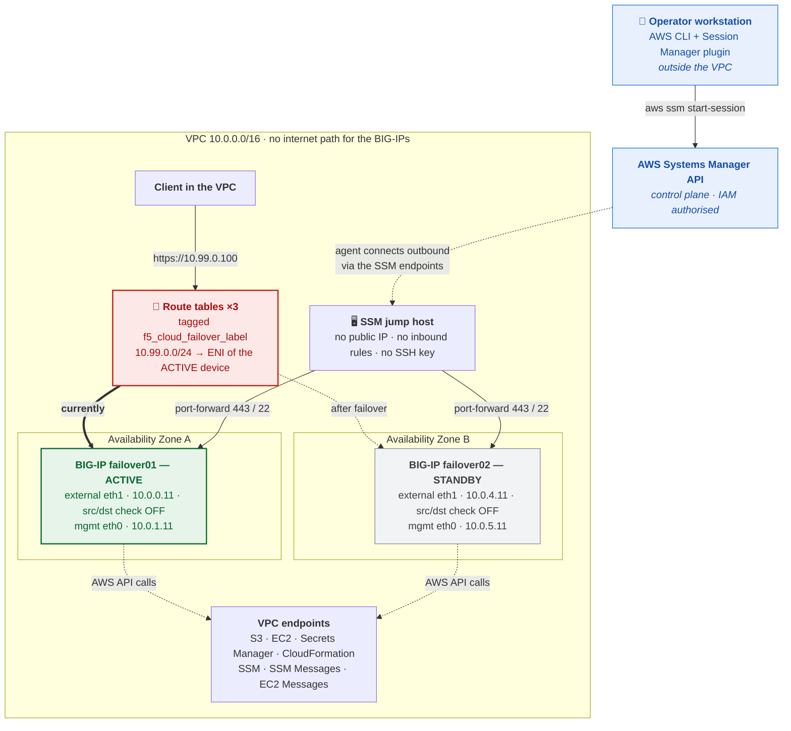
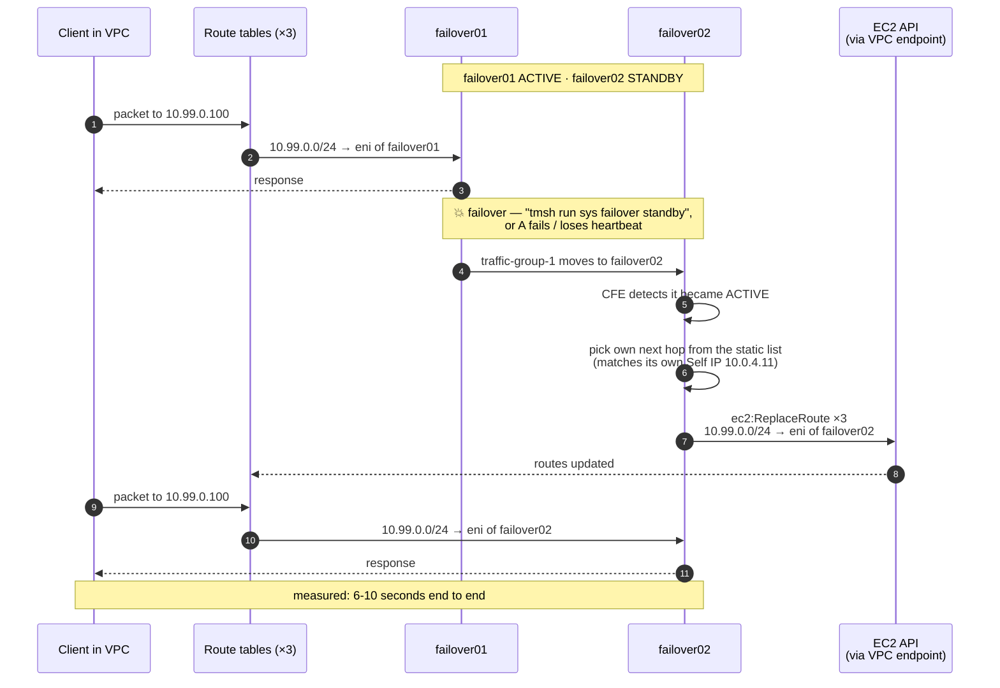
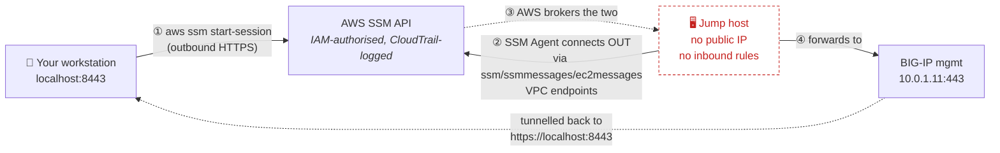

# Air-gap BIG-IP failover in AWS GovCloud — deployment guide

A complete, first-time-operator walkthrough for deploying an active/standby BIG-IP pair
into AWS GovCloud with **no public IP addresses anywhere**, and an application VIP that
fails over between Availability Zones **without an Elastic IP**.

**This guide is self-contained.** Everything needed to deploy, reach, validate and
troubleshoot the solution is here — you should not need to open another document to get a
working stack. [`examples/failover/GOVCLOUD-GUIDE.md`](../failover/GOVCLOUD-GUIDE.md)
covers the *other* solution in this repository, the EIP-based failover pair; read it only
if you are deploying that instead, or want more background on GovCloud generally.

> ### ✅ Lab-validated
> Deployed and failover-tested end to end in `us-gov-east-1` on **2026-09-08**, on the
> 3-NIC PAYG BIG-IP 17.5.1.6 pair. VIP failover was verified in **both** directions across
> several runs and converged in **6-10 seconds**. Quote **10 seconds** to a customer for
> headroom. See [section 8](#8-testing-failover) for the method and the raw numbers.
> **Note the image change.** The default is now **BIG-IP 17.5.1.9-0.0.12, Best Plus 25Mbps** —
> the same bundle and throughput as the validated build, one patch newer. It was moved off
> 17.5.1.6 because a defect in that release scopes the admin user to the `Common` partition:
> `tmsh` lists the AS3-created application objects normally, but the GUI shows nothing under
> `Tenant_1`. **17.5.1.9 was confirmed to carry the fix** — it reports `all-partitions` on both
> devices. See the troubleshooting entry for the check and for the workaround that applies to
> any version.

---

## Contents

1. [What you are deploying](#1-what-you-are-deploying)
2. [How the VIP fails over](#2-how-the-vip-fails-over)
3. [Before you start](#3-before-you-start)
4. [Step-by-step deployment](#4-step-by-step-deployment)
5. [Getting into the BIG-IPs with Session Manager](#5-getting-into-the-big-ips-with-session-manager)
6. [Validating the deployment](#6-validating-the-deployment)
7. [Seeing it work in a browser](#7-seeing-it-work-in-a-browser)
8. [Testing failover](#8-testing-failover)
9. [What to plan for](#9-what-to-plan-for)
10. [Tearing the stack down](#10-tearing-the-stack-down)
11. [Troubleshooting](#11-troubleshooting)

---

## 1. What you are deploying

Two BIG-IP Virtual Editions in an active/standby pair, one in each of two Availability
Zones, plus a small jump host for management access. Nothing in the VPC has a public IP
address, and every AWS API call the BIG-IPs make is served by a VPC endpoint inside the
VPC rather than over the internet.



**What makes the air gap real.** The private subnets have **no default route** — no NAT
gateway, no Elastic IP, no path to the internet at all. Everything the solution needs is
reachable without one:

| Dependency | How it is served with no egress |
|---|---|
| Templates, runtime-init installer, extension RPMs, WAF policy | **S3 gateway endpoint**, attached to the private route tables |
| EC2, Secrets Manager, CloudFormation, Systems Manager APIs | **Interface endpoints** with private DNS |
| DNS | **`169.254.169.253`** — the link-local VPC resolver |
| NTP | **`169.254.169.123`** — Amazon Time Sync, link-local |
| Runtime-init installer's own GPG public key | **A copy staged in your bucket**, selected with `--key` (see below) |
| Runtime-init installer's toolchain metadata index | **Skipped** with `--skip-toolchain-metadata-sync` |

> 🔑 **The last two rows are the ones that catch people out.** Downloading the
> runtime-init installer from your bucket is not enough. Once it starts, the installer
> makes two *further* downloads of its own, to URLs that are hard-coded inside it:
>
> 1. **Its GPG public key**, from `https://f5-cft.s3.amazonaws.com/...`. Note the missing
>    `us-gov` — that is a bucket in the **commercial** AWS partition, so a GovCloud S3
>    gateway endpoint does not serve it and there is no route to it. This fetch is
>    **fatal**: the installer loops on a 5-second timeout and never installs, so
>    runtime-init never runs, the admin password is never set, and the stack sits in
>    `CREATE_IN_PROGRESS` until it times out ~50 minutes later.
> 2. **The automation toolchain metadata index.** This one is non-fatal, but it retries
>    24 times before giving up, adding many minutes to every boot.
>
> This template handles both for you. It always passes
> `--skip-toolchain-metadata-sync --key <your bucket>/gpg.key` to the installer, which is
> why step 4.4 stages `gpg.key` as a fifth artifact. Signature verification stays **on** —
> the key is simply served from inside your VPC instead of the public internet. If you
> would rather not stage the key at all you can set the `bigIpRuntimeInitGpgKeyUrl`
> parameter to a URL of your own, but do not skip verification unless you accept an
> unverified RPM.

> ⚠️ **Anything you add that expects internet egress will fail**, including
> `provisionExampleApp='true'`, which pulls a container image. If you need egress, set
> `provisionNatGateways` back to `true` in the `Network` stack parameters — and accept that
> it reintroduces two Elastic IPs and a route out of the BIG-IP management and internal
> subnets, which an assessor will find.

**The moving pieces:**

| Piece | What it is | Why it is here |
|---|---|---|
| **BIG-IP pair** | Two VEs, 3 NICs each (management, external, internal), clustered active/standby | The HA pair serving your application |
| **Application VIP** `10.99.0.100` | An address **outside the VPC CIDR** | It belongs to no subnet, so it can be routed to either AZ — this is the whole trick |
| **Route tables** | Three, each with a route for `10.99.0.0/24` and tagged `f5_cloud_failover_label` | How clients reach the VIP, and what moves on failover |
| **Cloud Failover Extension (CFE)** | An F5 extension running on each BIG-IP | On failover it calls `ec2:ReplaceRoute` to re-point those routes |
| **Declarative Onboarding (DO)** | F5 extension | Builds the cluster, VLANs and Self IPs at first boot |
| **Application Services (AS3)** | F5 extension | Creates the virtual server bound to the VIP |
| **BIG-IP Runtime Init** | F5 bootstrapper | Downloads and applies DO/AS3/CFE from your S3 bucket at boot |
| **SSM jump host** | Amazon Linux 2023, `t3.micro` | The only way in. BIG-IP cannot run the SSM Agent, so this hop exists |
| **VPC endpoints** | S3, EC2, Secrets Manager, CloudFormation, SSM ×3 | Let the BIG-IPs and jump host reach AWS APIs with no internet |

---

## 2. How the VIP fails over

### Why the standard template cannot do this

In the EIP-based [`examples/failover`](../failover/README.md) solution, each BIG-IP is in
its own AZ, so its own subnet. The VIP is a **secondary private IP** on each device's
external interface:

| BIG-IP | AZ | External subnet | Self IP | VIP (secondary) |
|---|---|---|---|---|
| failover01 | A | `10.0.0.0/24` | `10.0.0.11` | `10.0.0.101` |
| failover02 | B | `10.0.4.0/24` | `10.0.4.11` | `10.0.4.101` |

A secondary private IP must belong to its subnet's CIDR. AWS will not assign `10.0.0.101`
to an interface in `10.0.4.0/24`, so those are two independent addresses and the only
thing CFE can move between them is an **Elastic IP association**.

Remove the Elastic IP — as an air-gapped deployment must — and CFE has nothing to
relocate. The stack deploys, the cluster forms, `cloud-failover/inspect` looks healthy,
and **the VIP silently never moves**. That is the problem this template solves.

### What this template does instead

The VIP is an address outside the VPC CIDR, so AWS has no implicit route for it. The
template creates one in every route table, pointing at the active BIG-IP's external
interface. On failover, CFE re-points them.



The client never changes the address it is talking to. No addressing changes anywhere —
just three API calls.

### Five things must line up

The template does all five for you; they are listed so you know what to check if
something is wrong.

| # | Requirement | Where it happens |
|---|---|---|
| 1 | A route for the VIP prefix in every route table clients use | `VipRoutePublic`, `VipRoutePrivateA`, `VipRoutePrivateB` in `failover-airgap.yaml` |
| 2 | Route tables tagged so CFE can **find** them and IAM **allows** the write | `modules/network` parameter `routeTableFailoverTag` (set to `cfeTag`) |
| 3 | Source/destination checking **off** on both external interfaces | `modules/bigip-standalone` parameter `disableSourceDestCheck` |
| 4 | `failoverRoutes` in the CFE declaration, with **bare** Self IPs as next hops | `bigip-configurations/runtime-init-conf-*-airgap.yaml` |
| 5 | An AS3 virtual server bound to the VIP address | same files, `Service_Address_01` |

> **Why "source/destination check off" matters.** AWS normally drops any packet arriving
> at an interface that is not addressed to that interface. The VIP is not one of the
> BIG-IP's own addresses, so without this the traffic is discarded before BIG-IP ever
> sees it. The template disables it on the interface resource itself, so it survives
> reboots.

> **Why "bare" Self IPs matters.** CFE matches the next-hop list against each device's own
> addresses to decide which hop is its own. An entry with a mask (`10.0.0.11/24`) never
> matches a bare address (`10.0.0.11`), and the device that fails to match performs **zero**
> route operations while still reporting success. This was a real bug, found in lab on
> 2026-09-08 and fixed; see [troubleshooting](#failover-succeeds-but-the-route-never-moves).

---

## 3. Before you start

### 3.1 On the AWS side

- **An AWS GovCloud account** with permission to create VPCs, EC2 instances, IAM roles
  (`CAPABILITY_NAMED_IAM`), S3 buckets, Secrets Manager secrets and VPC endpoints.
- **One Region, used consistently.** Pick `us-gov-east-1` or `us-gov-west-1` and use it
  for the stack, the S3 bucket, the key pair and the secret. VPC endpoints are regional —
  an endpoint in one Region cannot reach a bucket in another, so a cross-Region setup
  breaks the air gap even if it appears to work.
- **A subscription to the BIG-IP marketplace image** for your Region.
- **A staging S3 bucket** holding the templates and BIG-IP artifacts (step 4.4).

### 3.2 Three machines — know which one you are typing on

This guide moves between three machines, and most wasted time comes from running a command
on the wrong one. Commands are labelled throughout:

| Label | Machine | How you get there | What lives there |
|---|---|---|---|
| 🖥️ **WORKSTATION** | Your laptop | You are already on it | The AWS CLI, your git clone, your `.pem` file, the shell variables `$REGION` / `$BUCKET` / `$PREFIX` / `$STACK` |
| 🔒 **JUMP HOST** | The `t3.micro` in the VPC | `aws ssm start-session --target <jump host id>` | An in-VPC shell for reaching the BIG-IPs and curling the VIP. No repo, no AWS credentials of yours |
| ⚙️ **BIG-IP** | `10.0.1.11` / `10.0.5.11` | `ssh admin@10.0.x.11` from the jump host, or a forwarded port | The onboarding logs, `tmsh`, the CFE state. **No git, no repo, and none of your shell variables** |

Two consequences worth internalising, because both produce answers that look real but are not:

- **Shell variables do not travel.** `$BUCKET` and friends are set on the workstation only.
  A `curl "https://${BUCKET}.s3..."` run on the BIG-IP silently becomes
  `https://.s3..amazonaws.com/`, returns nothing, and any `grep -c` over it reports `0` — a
  clean-looking "not found" that is really "never asked".
- **The repo is not on the BIG-IP.** `git` and `grep` against `examples/...` only work on
  the workstation.

**Prerequisites on the workstation:**

- **A clone of this repository.** [Step 4.1](#41-get-the-files-and-know-where-you-are) has
  the `git clone` command. Most of section 4 runs from inside it, using relative paths.
- **`git`.** Pre-installed on macOS and most Linux distributions; on Windows use Git Bash
  or WSL.
- **The AWS CLI v2**, configured for your GovCloud account.
- **Python 3** — used only to pretty-print JSON in the verification commands.
- **The AWS Session Manager plugin.** This is a *separate install* from the AWS CLI and is
  the single most commonly missed prerequisite. Without it, `aws ssm start-session` fails
  with `SessionManagerPlugin is not found` and you cannot reach the BIG-IPs at all.

<details>
<summary><b>Installing the Session Manager plugin</b> (click to expand)</summary>

**macOS — with Homebrew (easiest):**

```bash
brew install --cask session-manager-plugin
```

**macOS — official installer.** Check your chip first with `uname -m`:

```bash
cd /tmp
# Apple Silicon (arm64)
curl -o sessionmanager-bundle.zip \
  "https://s3.amazonaws.com/session-manager-downloads/plugin/latest/mac_arm64/sessionmanager-bundle.zip"
# Intel (x86_64) — use this URL instead
# curl -o sessionmanager-bundle.zip \
#   "https://s3.amazonaws.com/session-manager-downloads/plugin/latest/mac/sessionmanager-bundle.zip"

unzip -o sessionmanager-bundle.zip
sudo ./sessionmanager-bundle/install \
  -i /usr/local/sessionmanagerplugin -b /usr/local/bin/session-manager-plugin
```

**Linux (RPM):**

```bash
curl -o session-manager-plugin.rpm \
  "https://s3.amazonaws.com/session-manager-downloads/plugin/latest/linux_64bit/session-manager-plugin.rpm"
sudo yum install -y session-manager-plugin.rpm
```

**Linux (Debian/Ubuntu):**

```bash
curl -o session-manager-plugin.deb \
  "https://s3.amazonaws.com/session-manager-downloads/plugin/latest/ubuntu_64bit/session-manager-plugin.deb"
sudo dpkg -i session-manager-plugin.deb
```

**Windows:** download and run the installer from
[AWS's documentation](https://docs.aws.amazon.com/systems-manager/latest/userguide/session-manager-working-with-install-plugin.html).

**Verify — on any platform:**

```bash
hash -r          # zsh/bash cache command paths; this makes the shell notice the new binary
session-manager-plugin
# → "The Session Manager plugin was installed successfully. Use the AWS CLI to start a session."
```

</details>

- **IAM permission to start sessions.** Your identity needs `ssm:StartSession` on the jump
  instance and on the `AWS-StartPortForwardingSessionToRemoteHost` document.
- **Reachability of the AWS API.** Session Manager works by your workstation talking to the
  AWS *control plane*, not to the VPC. If you can run `aws cloudformation describe-stacks`,
  you are fine. In a fully disconnected enclave with no AWS API access at all, Session
  Manager cannot help and you would need private connectivity (Direct Connect/VPN) instead.

### 3.3 Choosing your VIP prefix

`externalVipCidr` (default `10.99.0.0/24`) and `externalVipAddress` (default
`10.99.0.100`) need thought before you deploy:

- The prefix **must not overlap** the VPC CIDR, any peered VPC, or any on-premises range
  reachable over Direct Connect, VPN or Transit Gateway. It is routed *inside* this VPC,
  so a collision black-holes real traffic.
- The address must be **inside** the prefix.
- The **same prefix** is used for the route and for CFE's scoping range. CFE's prefix
  matching is exact — do not route a `/32` and scope a `/24`.

---

## 4. Step-by-step deployment

### 4.1 Get the files, and know where you are

Everything in section 4 runs 🖥️ **WORKSTATION**, from inside a clone of this repository.
If you skip this step, later commands fail with "no such file or directory" — they use paths
relative to the repository root.

**Clone it.** `git` is pre-installed on macOS and most Linux distributions; on Windows use
Git Bash or WSL.

```bash
cd ~
git clone https://github.com/therealnoof/f5-aws-cloudformation-v2-govcloud.git
cd f5-aws-cloudformation-v2-govcloud
pwd
ls
```

`pwd` prints where you are — it should end in `/f5-aws-cloudformation-v2-govcloud`. `ls` should
list an `examples` directory. **This is your working directory for the whole of section 4.**

> **If you open a new terminal later, `cd` back here first.** Commands such as
> `aws s3 sync ./examples/` and `--parameters file://examples/...` are relative paths. Run them
> from your home directory and they will not find anything — which usually looks like a
> different error than "wrong directory", so it is worth checking `pwd` first when something
> unexpected happens.

> **Cloned somewhere else, or renamed the directory?** That is fine — nothing depends on the
> path or the folder name, only on being *inside* the clone. Everywhere below that says to return
> to the repository root, this works from any subdirectory of it regardless of where it lives:
>
> ```bash
> cd "$(git rev-parse --show-toplevel)"
> ```
>
> If that prints `not a git repository`, you are outside the clone entirely — `cd` to it first.

**Already have a clone?** Make sure it is current — the BIG-IPs read what you upload from it,
so a stale clone deploys stale templates. Run this **inside your existing clone**, wherever it is:

```bash
cd "$(git rev-parse --show-toplevel)"
git remote -v          # confirm this is the right repository
git pull
git log --oneline -1
```

**Set your variables.** These are used by nearly every command that follows. Shell variables
live only in the terminal window where you set them, so **set them again in each new terminal**
— an unset variable does not error, it silently expands to nothing and produces a malformed
command that often *looks* like a real failure.

```bash
REGION=us-gov-east-1
BUCKET=f5-cft-gov                                   # must be globally unique
PREFIX=f5-aws-cloudformation-v2/v3.6.0.0/examples
STACK=failover-airgap
```

Check they took:

```bash
echo "REGION=$REGION  BUCKET=$BUCKET"
echo "PREFIX=$PREFIX  STACK=$STACK"
```

Any of those printing blank after the `=` means the variable is not set in this terminal.

> **zsh users:** zsh does not word-split unquoted variables the way bash does. Where a
> command below takes a *list* (several route table IDs, for example), the IDs are written
> out literally rather than passed through one variable. If you build your own, use a zsh
> array — `RTBS=(rtb-aaa rtb-bbb)` — not `RTBS="rtb-aaa rtb-bbb"`.

### 4.2 Create the admin password secret

The BIG-IPs read their admin password from AWS Secrets Manager at boot. Both devices use
the **same** secret — that shared credential is also what lets them establish device trust
with each other, and it is the password you will log in with.

```bash
aws secretsmanager create-secret --region "$REGION" \
  --name f5-bigip-admin-password \
  --secret-string 'CHANGE-ME-to-a-strong-password'

# Note the ARN it returns — you need it in step 4.7
aws secretsmanager list-secrets --region "$REGION" \
  --query 'SecretList[].[Name,ARN]' --output table
```

> **You can skip this step.** Leave `bigIpSecretArn` blank and the stack creates a secret
> named `<uniqueString>-bigIpSecret` for you. But the password it generates is only **10
> characters with punctuation excluded**, which is weak for a government deployment — and
> because both devices share it, it is also the device-trust credential. Create your own
> unless this is a throwaway lab. Retrieve a generated one with the command in section 5.3.

### 4.3 Create an SSH key pair

```bash
aws ec2 create-key-pair --region "$REGION" --key-name f5-airgap-key \
  --query 'KeyMaterial' --output text > ~/.ssh/f5-airgap-key.pem
chmod 400 ~/.ssh/f5-airgap-key.pem
```

You pass the key pair **name** (`f5-airgap-key`), not the file path and not the key text.

> **You can skip this step too.** Leave `sshKey` blank and the stack creates
> `<uniqueString>-keyPair`, with the private key in Systems Manager Parameter Store under
> `/ec2/keypair/<key-pair-id>`. SSH keys matter less here than in a normal deployment: no
> BIG-IP has a public IP, and you reach them through Session Manager logging in as `admin`
> with the password from your secret, not with a key.

### 4.4 Stage the S3 bucket

The BIG-IPs and CloudFormation both read everything from this bucket. There are two kinds
of object, and they get there differently:

- **Templates** (`modules/**`, `failover-airgap/**`) — copied by `aws s3 sync` from this repo.
- **BIG-IP artifacts** — the runtime-init installer and three extension RPMs. These are
  **not in the repo** and `s3 sync` will not copy them. Download and `cp` them separately.

**Download the artifacts** (once, 🖥️ WORKSTATION, from a machine with internet).

Run these from the repository root — the same directory as section 4.1. They download into an
`artifacts/` folder beside `examples/`, which keeps them together and out of the way of
`s3 sync` (that only ever copies `examples/`):

```bash
cd "$(git rev-parse --show-toplevel)"     # jump to the repository root from anywhere inside it
mkdir -p artifacts

curl -fL -o artifacts/f5-bigip-runtime-init-2.0.3-1.gz.run \
  https://github.com/F5Networks/f5-bigip-runtime-init/releases/download/2.0.3/f5-bigip-runtime-init-2.0.3-1.gz.run
curl -fL -o artifacts/f5-declarative-onboarding-1.47.0-14.noarch.rpm \
  https://github.com/F5Networks/f5-declarative-onboarding/releases/download/v1.47.0/f5-declarative-onboarding-1.47.0-14.noarch.rpm
curl -fL -o artifacts/f5-appsvcs-3.56.0-10.noarch.rpm \
  https://github.com/F5Networks/f5-appsvcs-extension/releases/download/v3.56.0/f5-appsvcs-3.56.0-10.noarch.rpm
curl -fL -o artifacts/f5-cloud-failover-2.4.0-0.noarch.rpm \
  https://github.com/F5Networks/f5-cloud-failover-extension/releases/download/v2.4.0/f5-cloud-failover-2.4.0-0.noarch.rpm

# The GPG public key the installer uses to verify its own RPM signature.
# Required — see the note in section 1. Without it the BIG-IPs never onboard.
curl -fL -o artifacts/gpg.key \
  https://f5-cft.s3.amazonaws.com/f5-bigip-runtime-init/gpg.key
```

Confirm you got five files, none of them tiny — a few hundred bytes means you captured an
error page rather than the file:

```bash
ls -lh artifacts/
```

> Check what you got: `gpg.key` should be about 3.2 KB and start with
> `-----BEGIN PGP PUBLIC KEY BLOCK-----`. As of 2026-09 its SHA-256 is
> `5e329086089056079b32f6828b2e2c6fde5dcae8bef62b1f06308af1ede7072b`
> (`sha256sum artifacts/gpg.key`). F5 may rotate the key; a mismatch is not automatically wrong,
> but a file that does not begin with the PGP header is — you probably captured an
> HTML error page.

> The RPM versions above match the `extensionHash` values pinned in the runtime-init
> config files, which the BIG-IP enforces at install time. If you change a version, update
> its `extensionVersion` and `extensionHash` too.

**Create the bucket and upload.** 🖥️ WORKSTATION, **from the repository root** — both the
`./examples/` and `artifacts/...` paths below are relative to it:

```bash
cd "$(git rev-parse --show-toplevel)"     # jump to the repository root from anywhere inside it
pwd                                        # sanity check before uploading anything

aws s3api create-bucket --bucket "$BUCKET" --region "$REGION" \
  --create-bucket-configuration LocationConstraint="$REGION"

# the templates, from the repository
aws s3 sync ./examples/ "s3://$BUCKET/$PREFIX/" --region "$REGION"

# the five artifacts, from the folder you just downloaded them into
aws s3 cp artifacts/f5-bigip-runtime-init-2.0.3-1.gz.run           "s3://$BUCKET/$PREFIX/" --region "$REGION"
aws s3 cp artifacts/gpg.key                                        "s3://$BUCKET/$PREFIX/" --region "$REGION"
aws s3 cp artifacts/f5-declarative-onboarding-1.47.0-14.noarch.rpm "s3://$BUCKET/$PREFIX/bigip-extensions/" --region "$REGION"
aws s3 cp artifacts/f5-appsvcs-3.56.0-10.noarch.rpm                "s3://$BUCKET/$PREFIX/bigip-extensions/" --region "$REGION"
aws s3 cp artifacts/f5-cloud-failover-2.4.0-0.noarch.rpm           "s3://$BUCKET/$PREFIX/bigip-extensions/" --region "$REGION"
```

> **Why two different commands.** `s3 sync` copies a whole directory tree and skips what has
> not changed — right for the templates, which is why it points at `./examples/`. `s3 cp`
> copies one named file and always overwrites — right for the artifacts, which are not in the
> repository at all. The two are not interchangeable, and `sync` will never upload the
> artifacts no matter how many times you run it.

> ⚠️ **Never add `--delete` to that sync.** The installer and RPMs live only in the bucket,
> not in the repo, so `--delete` would remove them and every BIG-IP would fail to onboard.

**If you are updating an existing bucket**, the same `s3 sync` is all you need — it is
idempotent and uploads only what changed. Re-run it after *any* local edit to a template
or runtime-init file: the BIG-IPs read the bucket copy, not your working tree. A stale
bucket is the single most confusing failure mode, because the stack deploys perfectly and
the BIG-IPs quietly use the old configuration.

### 4.5 Make the artifacts readable (required)

CloudFormation fetches the nested *templates* using your IAM credentials, so a private
bucket is fine for those. But each **BIG-IP downloads the installer, its runtime-init
config and the RPMs at boot using unauthenticated HTTPS** — no AWS signature. If those
objects are not anonymously readable the BIG-IP gets HTTP 403, runtime-init never
installs, nothing is configured, and the stack rolls back, often with no obvious error.

GovCloud enables Block Public Access and disables ACLs by default, so you grant read with
a bucket policy. Clearing Block Public Access alone grants nothing.

```bash
aws s3api put-public-access-block --bucket "$BUCKET" \
  --public-access-block-configuration \
    BlockPublicAcls=true,IgnorePublicAcls=true,BlockPublicPolicy=false,RestrictPublicBuckets=false

cat > /tmp/bucket-policy.json <<EOF
{
  "Version": "2012-10-17",
  "Statement": [
    {
      "Sid": "PublicReadGetObject",
      "Effect": "Allow",
      "Principal": "*",
      "Action": "s3:GetObject",
      "Resource": "arn:aws-us-gov:s3:::${BUCKET}/*"
    },
    {
      "Sid": "DenyInsecureTransport",
      "Effect": "Deny",
      "Principal": "*",
      "Action": "s3:*",
      "Resource": [
        "arn:aws-us-gov:s3:::${BUCKET}",
        "arn:aws-us-gov:s3:::${BUCKET}/*"
      ],
      "Condition": { "Bool": { "aws:SecureTransport": "false" } }
    }
  ]
}
EOF

aws s3api put-bucket-policy --bucket "$BUCKET" --policy file:///tmp/bucket-policy.json
```

Grant `s3:GetObject` only — never `PutObject` or `DeleteObject` to `Principal: "*"`.
`s3:ListBucket` is deliberately omitted so the bucket cannot be enumerated. If you know
your consumer account IDs, scope `Principal` to those instead of `"*"`.

<details>
<summary><b>If your security posture forbids any public-read bucket</b> (click to expand)</summary>

First, one trap worth stating plainly: **an S3 gateway endpoint alone does not fix the
403.** The default bootstrap sends an *unsigned* request, which a private bucket rejects
regardless of the endpoint. The endpoint only helps once the request is IAM-signed.

Three options, all of which avoid public exposure:

- **A — IAM-signed pulls (bucket stays private).** Scope the bucket policy to the BIG-IP
  instance role, leave Block Public Access on, keep the S3 gateway endpoint, and have the
  bootstrap fetch artifacts with signed requests. Fully in-partition and no public exposure,
  but it requires customising how runtime-init fetches its artifacts.
- **B — pre-signed URLs.** Pass pre-signed S3 URLs via `bigIpRuntimeInitPackageUrl`,
  `bigIpRuntimeInitConfig01` / `02`, and the RPM `extensionUrl` values in the runtime-init
  configs. Simple, but the URLs expire, so it suits one-off builds rather than a pattern you
  redeploy.
- **C — custom image.** Bake the artifacts into a custom BIG-IP image with the
  [F5 Image Generation Tool](https://clouddocs.f5.com/cloud/public/v1/ve-image-gen_index.html).
  Most work up front, least at deploy time, and nothing is fetched at boot at all.

Public-read of a bucket containing only F5 installation artifacts is the simplest option and
is what this guide documents. The three above are the alternatives when that is not
acceptable.

</details>

**Verify every object the BIG-IP needs. All must return `200`:**

```bash
for KEY in \
  "${PREFIX}/failover-airgap/failover-airgap.yaml" \
  "${PREFIX}/failover-airgap/bigip-configurations/runtime-init-conf-3nic-payg-instance01-airgap.yaml" \
  "${PREFIX}/failover-airgap/bigip-configurations/runtime-init-conf-3nic-payg-instance02-airgap.yaml" \
  "${PREFIX}/modules/ssm-jump/ssm-jump.yaml" \
  "${PREFIX}/modules/network/network.yaml" \
  "${PREFIX}/modules/bigip-standalone/bigip-standalone.yaml" \
  "${PREFIX}/f5-bigip-runtime-init-2.0.3-1.gz.run" \
  "${PREFIX}/gpg.key" \
  "${PREFIX}/bigip-extensions/f5-declarative-onboarding-1.47.0-14.noarch.rpm" \
  "${PREFIX}/bigip-extensions/f5-appsvcs-3.56.0-10.noarch.rpm" \
  "${PREFIX}/bigip-extensions/f5-cloud-failover-2.4.0-0.noarch.rpm" \
  "${PREFIX}/autoscale/bigip-configurations/Rapid_Deployment_Policy_13_1.xml"; do
  printf '%s  %s\n' \
    "$(curl -sk -o /dev/null -w '%{http_code}' "https://${BUCKET}.s3.${REGION}.amazonaws.com/${KEY}")" "$KEY"
done
```

`403` means the policy or Block Public Access setting has not taken effect. `404` on the
`.run`, `gpg.key` or an `.rpm` means it was never uploaded — none of them are part of
`s3 sync`.

### 4.6 Pre-flight checks

Three checks that fail *cheaply* now instead of expensively mid-deploy.

**Is the bucket serving the templates you think it is?** 🖥️ WORKSTATION

The highest-value check in this guide, and the one worth running every single time.
**CloudFormation and the BIG-IPs read the bucket, never your working tree.** A stale bucket
deploys perfectly and then behaves like an older version, which reads as a code bug and is
not one.

Checking a single file is not enough. The air-gap behaviour is split across two: the module
`bigip-standalone.yaml` *accepts* the installer flags, and the parent `failover-airgap.yaml`
*supplies* them. The module parameter defaults to an empty string deliberately, so the other
examples stay unaffected — which means **a current module plus a stale parent raises no error
at all**. It quietly reverts to the internet-dependent behaviour and then fails looking
exactly like an air-gap networking problem.

```bash
B="https://${BUCKET}.s3.${REGION}.amazonaws.com/${PREFIX}"

# sanity first: must print the template's first line, not XML and not nothing
curl -s "$B/failover-airgap/failover-airgap.yaml" | head -1

check() { printf '%-26s got=%-3s want=%s\n' "$2" "$(curl -s "$B/$1" | grep -c "$3")" "$4"; }

check failover-airgap/failover-airgap.yaml           "parent: flags"     bigIpRuntimeInitInstallerFlags 2
check failover-airgap/failover-airgap.yaml           "parent: gpg param" bigIpRuntimeInitGpgKeyUrl      6
check failover-airgap/failover-airgap.yaml           "parent: cfe gate"  provisionCfeS3Bucket           1
check modules/bigip-standalone/bigip-standalone.yaml "module: flags"     INSTALLER_FLAGS                6
check modules/bigip-standalone/bigip-standalone.yaml "module: cfe gate"  provisionCfeS3Bucket           3
```

Every `got` must equal its `want`. A mismatch means that file did not sync — re-upload it
explicitly, then re-check:

```bash
aws s3 cp examples/failover-airgap/failover-airgap.yaml \
  "s3://${BUCKET}/${PREFIX}/failover-airgap/failover-airgap.yaml" --region "$REGION"
```

> **Why `s3 cp` rather than another `s3 sync`.** `sync` compares size and modification time
> and skips a local file that is not newer than the object already in the bucket. A `git
> merge` or checkout can leave a file whose timestamp loses that comparison, so `sync`
> reports success having uploaded nothing at all. `cp` always overwrites. If a marker is
> still wrong after a sync, reach for `cp`.

> **All five reporting `0` usually means the URL was wrong, not that the files are stale** —
> which is what the sanity `head -1` is for. It is also why these are marked
> 🖥️ WORKSTATION: run them on a BIG-IP and `${BUCKET}` is unset, the URL collapses to
> `https://.s3..amazonaws.com/`, and every count is a meaningless `0`.

**The jump host image.** 🖥️ WORKSTATION The jump host resolves its AMI from an AWS-published SSM
parameter. If that parameter is not present in your Region, the nested stack fails at
create time:

```bash
aws ssm get-parameter --region "$REGION" \
  --name /aws/service/ami-amazon-linux-latest/al2023-ami-kernel-default-x86_64 \
  --query 'Parameter.Value' --output text
```

An AMI ID means you are fine. An error means you must pass your own image as
`ssmJumpCustomImageId` — any AMI works provided the SSM Agent is installed and starts at
boot (Amazon Linux 2 and 2023 both do, as do most hardened AL2023 builds).

**The BIG-IP image.** 🖥️ WORKSTATION The template looks up the BIG-IP AMI by name pattern, and
availability differs by Region:

```bash
aws ec2 describe-images --region "$REGION" --owners aws-marketplace \
  --filters "Name=name,Values=*17.5.1.9-0.0.12*PAYG-Best Plus 25Mbps*" \
  --query 'reverse(sort_by(Images,&CreationDate))[].[Name,ImageId,CreationDate]' --output table
```

An empty result means the pinned default is not in your Region — find one that is, and set
`bigIpImage` to a pattern pinned to that version and build with the trailing timestamp
wildcarded, e.g. `*17.5.1.9-0.0.12*PAYG-Best Plus 25Mbps*`.

> ⚠️ **The image must include ASM.** The onboarding declaration provisions `asm: nominal` and
> the AS3 declaration attaches a WAF policy, so a bundle without ASM onboards partway and then
> fails.
>
> | Bundle | Includes ASM | Use it here |
> |---|---|---|
> | Good | No | ❌ |
> | Better | No | ❌ |
> | Best / Best Plus | Yes | ✅ |
> | Adv WAF / Adv WAF Plus | Yes — Advanced WAF is the ASM successor | ✅ |
>
> **Do not assume "Best" is available for your version.** F5 has been moving PAYG listings onto
> the Advanced WAF naming, so which bundles exist varies by release. List what is actually
> published before you pin anything:
>
> ```bash
> aws ec2 describe-images --region "$REGION" --owners aws-marketplace \
>   --filters "Name=name,Values=F5 BIGIP-*" --query 'Images[].Name' --output text \
>   | tr '\t' '\n' \
>   | sed -E 's/^F5 BIGIP-([^ ]+) (.*)-[0-9]{12}-[0-9a-f-]+$/\1  \2/' \
>   | sort -u
> ```
>
> That prints one `version  bundle` line per published image, which is the quickest way to see
> which bundles a given release actually offers. If you pick an Adv WAF image, confirm the
> bundle also carries LTM on the first build — the virtual servers need it:
>
> ```bash
> # ⚙️ BIG-IP
> tmsh show sys provision
> ```

### 4.7 Fill in the parameters

Edit the parameters file in your clone — 🖥️ WORKSTATION, from the repository root:

```bash
cd "$(git rev-parse --show-toplevel)"
# open examples/failover-airgap/failover-airgap-parameters.json in any text editor
```

It is a plain JSON list of `ParameterKey` / `ParameterValue` pairs. Change only the values.

**Two parameters have no default — CloudFormation will not launch without them:**

| Parameter | Value |
|---|---|
| `restrictedSrcAddressMgmt` | Source CIDR allowed to reach BIG-IP management from outside the VPC |
| `restrictedSrcAddressApp` | Source CIDR allowed to reach the application from outside the VPC |

**Two more are optional but you should set them anyway:**

| Parameter | Value | Why not just leave it blank |
|---|---|---|
| `bigIpSecretArn` | The full secret ARN from step 4.2 | Blank generates a 10-character password with no punctuation — weak, and it doubles as the device-trust credential |
| `sshKey` | The key pair **name** from step 4.3 (e.g. `f5-airgap-key`) | Blank creates one, which is fine; set it if you want a key pair you already manage |

**Always confirm these match your bucket**, or the BIG-IPs will fetch the wrong artifacts —
or none at all:

| Parameter | Must match |
|---|---|
| `s3BucketName` | The bucket from step 4.4 |
| `s3BucketRegion` | That bucket's Region |
| `artifactLocation` | The prefix you synced to, **with a trailing slash** |

> The security groups already permit the VPC CIDR on management (22, 443) and on the
> application (80, 443), so the jump host and in-VPC clients work regardless of what you
> put in `restrictedSrcAddress*`. Those two parameters control access from **outside** the
> VPC. Set them deliberately rather than leaving them empty by accident.

Everything else can stay at its default. **Every parameter whose default is an empty string
is an optional override, not a blank you must fill in** — leaving it empty is the intended
setting:

| Parameter | What blank does |
|---|---|
| `bigIpRuntimeInitPackageUrl` | Derives the installer URL from your bucket settings |
| `bigIpRuntimeInitGpgKeyUrl` | Derives the `gpg.key` URL from your bucket settings |
| `bigIpRuntimeInitConfig01` / `02` | Derives the runtime-init config URLs from your bucket settings |
| `cfeS3Bucket` | Names and creates `<uniqueString>-bigip-high-availability-solution` |
| `bigIpCustomImageId` | Uses the marketplace image matched by `bigIpImage` |
| `bigIpInstanceProfile` | Creates a profile with the IAM permissions CFE needs |
| `bigIpLicenseKey01` / `02` | Correct for PAYG, which is what the default `bigIpImage` is |
| `ssmJumpCustomImageId` | Uses the current Amazon Linux 2023 AMI |

The console shows the same guidance: each of those descriptions now opens with
`OPTIONAL - leave blank`.

The full parameter reference is in [README.md](README.md#template-input-parameters).

### 4.8 Launch

🖥️ WORKSTATION, **from the repository root** — `--parameters file://examples/...` is a relative
path and fails from anywhere else:

```bash
cd "$(git rev-parse --show-toplevel)"     # jump to the repository root from anywhere inside it

aws cloudformation create-stack --region "$REGION" \
  --stack-name "$STACK" \
  --template-url "https://${BUCKET}.s3.${REGION}.amazonaws.com/${PREFIX}/failover-airgap/failover-airgap.yaml" \
  --capabilities CAPABILITY_NAMED_IAM \
  --parameters file://examples/failover-airgap/failover-airgap-parameters.json
```

> **On your first deployment, consider adding `--on-failure DO_NOTHING`.** By default a
> failed stack deletes its instances, taking the logs with it. `DO_NOTHING` preserves them
> so you can get on the boxes and read what happened. You clean up manually afterwards.

### 4.9 What to expect while it builds

**`CREATE_IN_PROGRESS` for roughly 25–30 minutes is normal**, not a hang. BIG-IP has a
documented device-trust startup bug where `/Common/Root` is not initialised on first boot,
so this solution installs a self-heal script that reboots each device once and forms the
cluster out of band. The stack only signals success once the cluster is genuinely
**In Sync**. The signal timeout is 50 minutes, after which a real failure surfaces as
`CREATE_FAILED` rather than hanging forever.

Watch progress:

```bash
aws cloudformation describe-stack-events --region "$REGION" --stack-name "$STACK" \
  --query 'StackEvents[?ResourceStatus!=`CREATE_IN_PROGRESS`].[Timestamp,LogicalResourceId,ResourceStatus,ResourceStatusReason]' \
  --output table | head -40
```

When it completes, read the outputs — they contain everything you need next:

```bash
aws cloudformation describe-stacks --region "$REGION" --stack-name "$STACK" \
  --query 'Stacks[0].Outputs[].[OutputKey,OutputValue]' --output table
```

### 4.10 What the self-heal is doing during those 25–30 minutes

Worth understanding, because it explains the long build and it is where you look first when
a build stalls.

**The problem it works around.** There is a documented BIG-IP / Declarative Onboarding
platform bug in the 17.x line: the device-trust domain `/Common/Root` is not fully
initialised after system startup. When it hits, DO cannot create the device trust or the
failover device group, clustering deadlocks — one device waiting for `Root`, the other for
the device group — and `/var/log/restnoded/restnoded.log` shows:

```
01020036:3: The requested trust domain (/Common/Root) was not found.
01020036:3: The requested device group (/Common/failoverGroup) was not found.
```

F5's documented workaround is *reboot (which rebuilds `Root`), then re-apply clustering*.
This is a platform timing issue — **not** caused by GovCloud, the security groups, the VPC
endpoints, or this template — and you cannot avoid it by choosing a different 17.x image.

**What ships to handle it.** The runtime-init config installs three things through its
`pre_onboard` hook:

| File | Purpose |
|---|---|
| `/config/cluster-heal.sh` | The orchestrator |
| `/config/cluster-heal-trust.py` | Fetches the admin password from Secrets Manager (SigV4, via the instance role) and calls `add-to-trust`. Stdlib-only, because BIG-IP has no `aws` CLI or `boto3` |
| `/etc/cron.d/cluster-heal` | Runs the orchestrator every 3 minutes |

**The DO declaration is left stock.** DO remains the declarative source of truth; the
self-heal only bootstraps what the platform bug prevented it from finishing, and the
resulting cluster matches the DO declaration. On a build where the bug does not occur, the
self-heal sees the cluster already In Sync and disables itself. It is a safety net, not a
dependency.

**What it does, per device, every 3 minutes — marker-gated so it never loops:**

1. Already In Sync? → signal CloudFormation success, remove the cron, mark done, stop.
2. Wait until onboarding has set the hostname and the box has been up long enough.
3. `Root` missing (the bug)? → save config and **reboot once** to rebuild it.
4. Trust not formed after the reboot? The **joiner** fetches the admin password and runs
   `add-to-trust` against the peer; the **owner** waits for the joiner.
5. Trust formed? → the owner creates `failoverGroup`, ensures `/LOCAL_ONLY` is excluded from
   config-sync, force-syncs, and each device acts on any sync recommendation.
6. In Sync → signal CloudFormation success, then disable itself.

That CloudFormation signal in steps 1 and 6 is why the CloudFormation VPC endpoint matters:
with no egress, the BIG-IP cannot reach `cloudformation.<region>.amazonaws.com`, and the
stack would time out even though the cluster formed correctly.

**Watching it.** From a jump host shell, SSH to a BIG-IP and:

```bash
tail -f /config/cluster-heal/log
```

That is the primary place to look — it narrates each phase: pre-reboot waits → reboot →
`add-to-trust` → `creating failoverGroup` → sync → `cluster In Sync` → `cfn-signal sent OK`
→ `disabling self-heal`. Marker files in `/config/cluster-heal/` (`rebooted`, `trust_tries`,
`signalled`, `done`) show how far it has got. Also useful:
`tmsh show cm sync-status`, `/var/log/cloud/bigIpRuntimeInit.log`,
`/var/log/restnoded/restnoded.log`.

> **Build times vary a lot.** A device that does not hit the bug clusters in about
> 6 minutes; one that does needs the reboot and retry cycle and can take 40+. Both are
> normal. **Let the full 50-minute timeout elapse before concluding a build has failed** —
> we killed a healthy build at 40 minutes during validation and learned nothing from it.

---

## 5. Getting into the BIG-IPs with Session Manager

There are no public IP addresses, so there is no SSH-from-the-internet. Instead you reach
the BIG-IPs *through* the jump host using AWS Systems Manager Session Manager.

**The important idea:** this is not a network connection into the VPC. The jump host makes
an **outbound** connection to the SSM service through the VPC endpoints; your workstation
talks to the **AWS API**; AWS brokers the two together. There is no inbound path, no open
port and no public address anywhere — which is exactly why it suits an air-gapped design.
Access is authorised by IAM and logged in CloudTrail.



### 5.1 The BIG-IP web GUI (TMUI)

The management interface has no public address, so you cannot browse to it directly.
Instead you forward a port on **your own machine** through the jump host to the BIG-IP's
management interface — then the GUI appears at `https://localhost:<port>` in your normal
browser, exactly as if it were running locally.

The stack gives you the complete command as an output, so you do not have to build it.

**Step 1 — get the command:**

```bash
aws cloudformation describe-stacks --region "$REGION" --stack-name "$STACK" \
  --query "Stacks[0].Outputs[?OutputKey=='ssmPortForwardBigIp01'].OutputValue" --output text
```

That prints something like:

```
aws ssm start-session --region us-gov-east-1 --target i-09fc242906bd8b56a \
  --document-name AWS-StartPortForwardingSessionToRemoteHost \
  --parameters '{"host":["10.0.1.11"],"portNumber":["443"],"localPortNumber":["8443"]}'
```

**Step 2 — paste and run it.** You should see:

```
Starting session with SessionId: your.name@example.com-0123456789abcdef
Port 8443 opened for sessionId ...
```

**Leave this terminal window open.** The tunnel exists only while the command runs —
closing the window or pressing `Ctrl+C` closes the GUI connection.

**Step 3 — open a browser** and go to:

```
https://localhost:8443
```

**Step 4 — accept the certificate warning.** BIG-IP ships with a self-signed certificate,
and your browser is being asked for `localhost` while the certificate names the device, so
a warning is expected and normal here. In Chrome/Edge click **Advanced → Proceed to
localhost (unsafe)**; in Firefox, **Advanced → Accept the Risk and Continue**; in Safari,
**Show Details → visit this website**.

**Step 5 — log in:**

| Field | Value |
|---|---|
| Username | `admin` |
| Password | The value of your `bigIpSecretArn` secret — or of the secret the stack created, if you left that parameter blank (see 5.3) |

Retrieve the password with:

```bash
aws secretsmanager get-secret-value --region "$REGION" \
  --secret-id <your-secret-arn> --query SecretString --output text
```

**For the second BIG-IP**, use the `ssmPortForwardBigIp02` output, which forwards to
`https://localhost:8444`. Each `start-session` holds its own terminal, so to have both GUIs
open at once, run the two commands in two separate terminal windows. The two local ports
(8443 and 8444) keep them apart.

> **Both devices share one admin password** — they read it from the same secret. That
> shared credential is also what lets them establish device trust with each other.

**REST API calls work through the same tunnel.** Anything you would `curl` against the
management interface just uses `localhost:8443`:

```bash
curl -sku admin:"$PW" https://localhost:8443/mgmt/shared/cloud-failover/inspect \
  | python3 -m json.tool
```

<details>
<summary><b>If the GUI will not load</b> (click to expand)</summary>

| Symptom | Cause |
|---|---|
| `SessionManagerPlugin is not found` | The plugin is not installed — see [section 3.2](#32-three-machines--know-which-one-you-are-typing-on), then run `hash -r`. |
| `TargetNotConnected` | The jump host has not registered with Systems Manager. See [troubleshooting](#targetnotconnected-or-the-jump-host-never-appears-in-systems-manager). |
| Browser says "connection refused" | The `start-session` command is not running, or you closed its window. Re-run it. |
| `Port 8443 in use` | Something else on your machine holds that port. Change `localPortNumber` to any free port (e.g. `8543`) and browse there instead. |
| Session starts, page hangs | The BIG-IP is still onboarding. Management comes up before configuration finishes; wait for the stack to reach `CREATE_COMPLETE`. |
| `AccessDeniedException` on `StartSession` | Your IAM identity lacks `ssm:StartSession` on the instance or on the `AWS-StartPortForwardingSessionToRemoteHost` document. |

</details>

**Where the application objects are — the GUI looks empty and is not.**

After a successful deployment the virtual servers, pool, iRule and WAF policy appear
**nowhere** under Common, and switching through every partition still shows nothing. The
objects are there; TMUI is just not showing them, for two reasons that stack:

- **The partition list is read at login.** AS3 creates the `Tenant_1` partition *during*
  onboarding. A browser session opened before that will not list it at all. **Log out and
  back in first** — this alone fixes most cases.
- **AS3 nests everything in folders, and TMUI lists only the folder you have selected.**
  Nothing sits directly in `Tenant_1`, so selecting that partition shows an empty screen. The
  objects live one level down:

| Folder | What is in it |
|---|---|
| `Tenant_1/HTTP_Service_01` | The HTTP virtual server (`serviceMain`) |
| `Tenant_1/HTTPS_Service_01` | The HTTPS virtual server (`serviceMain`) |
| `Tenant_1/Shared` | The pool, the demo iRule, the WAF policy, and the service address `10.99.0.100` |

In the partition selector at the top right, pick the **folder** (`Tenant_1/HTTP_Service_01`),
not just the partition. If your build offers an **`[All]`** option in that selector, that shows
everything at once and is the quickest way to look around.

Confirm from the CLI any time the GUI is confusing you — this is the ground truth:

```bash
# ⚙️ BIG-IP
tmsh -c 'cd /; list ltm virtual recursive one-line' | cut -c1-120
tmsh list auth partition
tmsh -c 'cd /; list sys folder recursive one-line' | cut -c1-100
```

You want `Tenant_1/HTTP_Service_01/serviceMain` and `Tenant_1/HTTPS_Service_01/serviceMain`.
If those exist, the deployment is fine and you are looking at a navigation problem. If the
listing is genuinely empty, check whether AS3 deployed at all:

```bash
curl -su admin:<password> http://localhost:8100/mgmt/shared/appsvcs/declare | python3 -m json.tool | head -40
```

> ⚠️ **Treat AS3 objects as read-only in the GUI.** AS3 owns everything under `Tenant_1`.
> Editing it by hand puts the running configuration out of step with the declaration, and the
> next AS3 deployment silently reverts your change. Use the GUI to inspect and demonstrate;
> make changes in the runtime-init configuration and redeploy.

> **On a demo:** the virtual server shows **Available (Offline)** with an empty pool, which is
> the case when `provisionExampleApp` is `false`. The demo iRule answers instead, so `curl`
> returns `200` while the GUI shows a red diamond. Explain that before someone points at it.

### 5.2 A shell on the jump host

This is your in-VPC test client — the easiest place to `curl` the VIP from.

```bash
JUMP=$(aws cloudformation describe-stacks --region "$REGION" --stack-name "$STACK" \
  --query "Stacks[0].Outputs[?OutputKey=='ssmJumpInstanceId'].OutputValue" --output text)

aws ssm start-session --region "$REGION" --target "$JUMP"
```

### 5.3 SSH to a BIG-IP

Easiest from a jump host shell — its security group already allows outbound 22 into the
VPC, and the BIG-IP management group allows 22 from the VPC CIDR:

```bash
# on the jump host
ssh admin@10.0.1.11        # failover01   (bigIpInstanceMgmtPrivateIp01)
ssh admin@10.0.5.11        # failover02   (bigIpInstanceMgmtPrivateIp02)
```

Use the admin password from your secret — **the same password on both devices**. Retrieve
it with:

```bash
aws secretsmanager get-secret-value --region "$REGION" \
  --secret-id <your-secret-arn> --query SecretString --output text
```

> **If you left `bigIpSecretArn` blank**, the stack created the secret for you and publishes
> its ARN as a stack output. Look it up, then read the password:
>
> ```bash
> SECRET=$(aws cloudformation describe-stacks --region "$REGION" --stack-name "$STACK" \
>   --query "Stacks[0].Outputs[?OutputKey=='bigIpSecretArn'].OutputValue" --output text)
> aws secretsmanager get-secret-value --region "$REGION" \
>   --secret-id "$SECRET" --query SecretString --output text
> ```
>
> Stack outputs only populate at `CREATE_COMPLETE`. Before that this returns `None` — that
> is too early, not an error.

Alternatively, forward a local port to management SSH and connect from your workstation:

```bash
aws ssm start-session --region "$REGION" --target "$JUMP" \
  --document-name AWS-StartPortForwardingSessionToRemoteHost \
  --parameters '{"host":["10.0.1.11"],"portNumber":["22"],"localPortNumber":["2222"]}'
# then, in another window:
ssh -p 2222 admin@localhost
```

> **Session logging.** Session Manager can record every session's keystrokes to CloudWatch
> Logs or S3 — materially better evidence for an ATO package than a bastion's syslog. It is
> an account-level Session Manager preference rather than a stack resource, so this
> template does not configure it. Enable it under **Systems Manager → Session Manager →
> Preferences** before first customer-facing use.

---

## 6. Validating the deployment

Run these after `CREATE_COMPLETE`, before testing failover. They confirm the five
requirements from [section 2](#five-things-must-line-up) are actually in place.

First collect the values you need:

```bash
aws cloudformation describe-stacks --region "$REGION" --stack-name "$STACK" \
  --query 'Stacks[0].Outputs[].[OutputKey,OutputValue]' --output table
```

Note `bigIpExternalInterfaceId01/02`, `vipRouteTableIds`, `vipAddress` and
`ssmJumpInstanceId` — the checks below use them. Substitute your own IDs for the examples.

**Check 1 — source/destination checking must be `False` on both external interfaces:**

```bash
aws ec2 describe-network-interfaces --region "$REGION" \
  --network-interface-ids eni-AAAA eni-BBBB \
  --query 'NetworkInterfaces[].[NetworkInterfaceId,SourceDestCheck]' --output table
```

**Check 2 — every route table tagged, and carrying the VIP route:**

```bash
aws ec2 describe-route-tables --region "$REGION" \
  --route-table-ids rtb-AAAA rtb-BBBB rtb-CCCC \
  --query "RouteTables[].[RouteTableId,Tags[?Key=='f5_cloud_failover_label'].Value|[0],Routes[?DestinationCidrBlock=='10.99.0.0/24'].NetworkInterfaceId|[0]]" \
  --output table
```

All three rows should show the tag value (`bigip_high_availability_solution` by default)
and the **same** external interface ID — instance A's, since the template points them
there initially.

**Check 3 — CFE has discovered the routes.** From a jump host shell:

```bash
PW='<admin password>'
curl -sku admin:"$PW" https://10.0.1.11/mgmt/shared/cloud-failover/inspect | python3 -m json.tool
```

`"routes"` must list your three route tables. `"addresses"` being empty is correct — this
design has no Elastic IPs to move. Note which device reports `"deviceStatus": "active"`.

**Check 4 — the next-hop list must contain bare addresses.** On **both** devices:

```bash
curl -sku admin:"$PW" https://10.0.1.11/mgmt/shared/cloud-failover/declare \
  | python3 -c 'import sys,json; print(json.load(sys.stdin)["declaration"]["failoverRoutes"]["routeGroupDefinitions"][0]["defaultNextHopAddresses"]["items"])'
# → ['10.0.0.11', '10.0.4.11']     ✅ both bare
# → ['10.0.0.11/24', '10.0.4.11']  ❌ see troubleshooting
```

**Check 5 — the active device and the route target must agree.** This one catches a real
condition seen in the lab: the template points all three routes at instance A when the stack
is built, but the initial election can make **instance B** active. CFE only acts on a
failover *transition*, so coming up active at boot does not move the routes - and the stack
reaches `CREATE_COMPLETE` with a VIP that has never passed traffic.

Compare the `deviceStatus` from check 3 with the route target from check 2. If they name
different devices, run **one** failover from the active device to sync them:

```bash
tmsh run sys failover standby
```

Then re-check. This is a normal post-deployment step, not a fault.

**Check 6 — the VIP answers.** From a jump host shell:

```bash
curl -sk https://10.99.0.100/ | grep -oE 'failover0[12][.a-z]*'
```

With no back-end application deployed, a built-in iRule answers and names the device that
served the request. Confirm it matches the device reporting `active` in check 3. If the
route points at the standby, the VIP will hang — see
[troubleshooting](#the-vip-does-not-answer-at-all).

---

## 7. Seeing it work in a browser

Every AS3 declaration here carries a `Demo_Responder` iRule. When the VIP's pool has no
active members — the case with `provisionExampleApp=false`, the default — it answers HTTP
and HTTPS itself with a page naming the BIG-IP that served it, the VIP, the client address
and the time, refreshing every two seconds. When a real back end is present, the rule steps
aside and traffic is load balanced normally, so it never needs removing.

For a demo, forward a local port to the VIP and leave the page open while you fail over:

```bash
aws ssm start-session --region "$REGION" --target "$JUMP" \
  --document-name AWS-StartPortForwardingSessionToRemoteHost \
  --parameters '{"host":["10.99.0.100"],"portNumber":["443"],"localPortNumber":["9443"]}'
# browse https://localhost:9443
```

"Served by failover01.local" becomes "failover02.local" a few seconds after you trigger a
failover. The page turning over is the whole mechanism in one screen: the route moved, the
peer took over, and the client never changed the address it was talking to.

Expect the tunnel to log a connection error at the moment of failover — the TCP session to
the old active device dies, and the page's auto-refresh re-establishes it. For *measuring*
convergence, prefer the on-host loop in section 8; the tunnel adds a variable you do not
want in the numbers.

### 7.1 The management GUI, through the same tunnel

The command above is not special to the VIP. **Only the `host` changes** — point it at a
BIG-IP's management address instead and you get that device's TMUI in the same browser:

```bash
# 🖥️ WORKSTATION — failover01's management GUI
aws ssm start-session --region "$REGION" --target "$JUMP" \
  --document-name AWS-StartPortForwardingSessionToRemoteHost \
  --parameters '{"host":["10.0.1.11"],"portNumber":["443"],"localPortNumber":["8443"]}'
# browse https://localhost:8443   —   admin / your Secrets Manager password
```

```bash
# 🖥️ WORKSTATION — failover02's management GUI, in a second terminal
aws ssm start-session --region "$REGION" --target "$JUMP" \
  --document-name AWS-StartPortForwardingSessionToRemoteHost \
  --parameters '{"host":["10.0.5.11"],"portNumber":["443"],"localPortNumber":["8444"]}'
# browse https://localhost:8444
```

| What you want to see | `host` | Local port | URL |
|---|---|---|---|
| The application VIP | `10.99.0.100` | `9443` | `https://localhost:9443` |
| failover01 management (TMUI) | `10.0.1.11` | `8443` | `https://localhost:8443` |
| failover02 management (TMUI) | `10.0.5.11` | `8444` | `https://localhost:8444` |

Each `start-session` holds its own terminal, and each needs a **different** `localPortNumber`,
so all three can be open at once. That is the arrangement worth having during a demo: the VIP
page in one tab flipping between devices, and both TMUIs in others showing Active and Standby
swapping in Device Management → Overview.

The certificate warning on the management URLs is expected — that is the BIG-IP's own
self-signed cert, not a proxy problem.

> **The application objects are not in Common.** AS3 creates them under `Tenant_1`, in folders.
> If Local Traffic → Virtual Servers looks empty, you are almost certainly looking at the wrong
> folder rather than at a broken deployment — see
> [section 5.1](#51-the-big-ip-web-gui-tmui) for where they are and why.

**What to check in the GUI**, once you are in:

| Where | What it confirms |
|---|---|
| Device Management → Overview | Both devices, one Active one Standby, green `In Sync` |
| Local Traffic → Virtual Servers (folder `Tenant_1/HTTP_Service_01`) | `serviceMain` bound to `10.99.0.100` — an address in **no subnet**, which is the whole trick |
| Network → Self IPs | `traffic-group-local-only` on every self IP — nothing floats |
| Network → Routes | The default route in partition **LOCAL_ONLY**, via this device's own AZ gateway |
| Security → Application Security → Policies | The WAF policy, fetched from your S3 bucket with no internet access |

---

## 8. Testing failover

**Test both directions.** They exercise different devices, and a fault can exist in only
one — which is exactly what happened during validation of this design.

**Window 1** — a shell on the jump host, running the measurement loop. Start it *before*
you trigger anything:

```bash
aws ssm start-session --region "$REGION" --target "$JUMP"
```
```bash
while true; do
  T=$(date +%H:%M:%S.%2N)
  R=$(curl -sk --max-time 1 https://10.99.0.100/ | grep -oE 'failover0[12][.a-z]*' | head -1)
  echo "$T ${R:-DOWN}"
  sleep 0.5
done
```

**Window 2** — a second jump host shell; SSH to whichever device is **active** and trigger:

```bash
ssh admin@10.0.1.11
tmsh show cm failover-status      # confirm this device is ACTIVE first
tmsh run sys failover standby
```

> ⚠️ **Issue `failover standby` on the active device only, once.** Running it on both
> devices in sequence can leave neither holding the traffic group, which looks exactly like
> a broken design but is a test artifact. Always confirm state with
> `tmsh show cm failover-status` before triggering.

**Read the result from the timestamps, not the line count.** Failed requests take the full
`--max-time 1` plus the sleep, so they are ~1.5 s apart while successful ones are ~0.5 s
apart. Counting `DOWN` lines badly understates the outage. Measure last-good to first-good:

```
17:51:51.30  failover01.local   ← last good response from A
17:51:51.82  DOWN
   ...
17:51:59.37  DOWN
17:52:00.88  failover02.local   ← first good response from B
```

**Confirm the routes actually moved:**

```bash
aws ec2 describe-route-tables --region "$REGION" \
  --route-table-ids rtb-AAAA rtb-BBBB rtb-CCCC \
  --query "RouteTables[].[RouteTableId,Routes[?DestinationCidrBlock=='10.99.0.0/24'].NetworkInterfaceId|[0]]" \
  --output table
```

All three should now show the *other* device's interface. And on the newly active device,
the log should show the work being done:

```bash
grep -E 'Next hop address|Update required|Route\(s\) updated|No route operations' \
  /var/log/restnoded/restnoded.log | tail -12
# want: "Next hop address: 10.0.x.11" and "Route(s) updated successfully"
# not:  "Next hop address: undefined" or "No route operations to run"
```

Then fail back and repeat.

### Measured results

| | |
|---|---|
| **Date / Region** | 2026-09-08, `us-gov-east-1` |
| **Build** | 3-NIC PAYG, BIG-IP 17.5.1.6-0.0.25, CFE 2.4.0, DO 1.47.0, AS3 3.56.0 |
| **Method** | 0.5 s poll from an in-VPC client, last-good to first-good response |
| **A → B** | 6 – 9.6 seconds |
| **B → A** | 6 – 9.6 seconds |

Individual runs, all last-good to first-good: **9.58 s**, **~6 s**, **9.58 s**. The same
pair on the same build converged in 6 seconds once and 9.6 seconds twice, so **run-to-run
variance is real** — treat any single measurement as indicative, not definitive.

This is a small sample in one environment. Measure it in your own before committing to a
Recovery Time Objective, and quote a figure with headroom — **10 seconds** is a reasonable
number to put in front of a customer for a design measured between 6 and 10.

> Note this is *better* than route-based failover is usually assumed to be. Earlier drafts
> of this guide estimated "tens of seconds"; the measured behaviour stays under ten.

### Automatic failover — losing the instance outright

Everything above is a **commanded** failover: `run sys failover standby` tells the peer to take
over immediately. That is not what a real outage looks like. When an instance simply disappears,
the survivor has to *notice* first — it waits for missed unicast failover heartbeats on UDP 1026,
roughly 3 seconds of silence, before declaring the peer down. Only then does CFE move the route.

Measured 2026-09-10, `us-gov-east-1`, 17.5.1.9-0.0.12, by stopping the Active instance with
`aws ec2 stop-instances` while polling the VIP from the jump host:

```
21:35:17.87  failover02.local     <- last good response
21:35:18.39  DOWN
   ... 8 consecutive failures ...
21:35:30.48  failover01.local     <- first good response
```

**12.6 seconds**, last-good to first-good. Roughly double the commanded case, which is expected
and not a fault — the extra time is detection, which a commanded failover skips entirely.

> **Quote the automatic number, not the commanded one.** A customer's RTO has to survive an
> instance being lost, not an administrator asking politely. **15 seconds** is a reasonable
> figure to put in front of one for a design measured at 12.6.

> ⚠️ **Do not measure this by counting poll iterations.** A tick is `sleep` *plus* however long
> `curl` takes, and `curl` behaves differently depending on the failure: a refused connection
> fails instantly, while a route pointing at a stopped instance black-holes and burns the full
> `-m` timeout. In the run above eight ticks spanned 12.6 s, about 1.5 s each — counting them as
> 0.5 s ticks would have reported 4 seconds. **Always use the timestamps.** This loop prints only
> transitions, so the two numbers you need are the only ones on screen:
>
> ```bash
> # 🔒 JUMP HOST
> prev=""
> while true; do
>   t=$(date +%H:%M:%S.%3N)
>   c=$(curl -s -m 2 -o /dev/null -w '%{http_code}' http://10.99.0.100/ 2>/dev/null || echo 000)
>   [ "$c" != "$prev" ] && { echo "$t  $c"; prev=$c; }
>   sleep 0.5
> done
> ```

Bring the instance back with `aws ec2 start-instances` afterwards. It should rejoin as
**Standby** — failover01 holds the route and has no reason to give it up — and the pair should
return to `In Sync` without intervention.

---

## 9. What to plan for

### Adding production VIPs after the demo

The single most common question once a customer is past the example application: **where do our
real VIPs go, and do they have to be AS3?**

**The unit of failover is the prefix, not the VIP.** The stack creates one route per route table
for the whole of `externalVipCidr` — `10.99.0.0/24` by default — pointed at the active device's
external interface, and CFE's `scopingAddressRanges` is that same prefix. CFE moves the *route*.
It never looks at your virtual server list and has no per-VIP configuration.

**So every address inside `externalVipCidr` already fails over.** `10.99.0.100` is simply the one
the example uses. `10.99.0.101` through `10.99.0.254` are already routed and already in scope.
Adding a production VIP requires:

- **no AWS change** — no new route, no route table edit, no ENI work
- **no CFE change** — no declaration update, no restart
- **nothing outside the BIG-IP at all**

That is roughly 254 VIPs from the deployment you already have, and it is the main practical
advantage of route-based failover over `failoverAddresses`: with secondary-IP failover you would
be assigning and moving an ENI address for every single VIP.

#### AS3 or by hand — both work, and they can coexist

CFE is agnostic about how the virtual server was created. Choose whichever suits the customer's
operating model:

| Method | Supported | Notes |
|---|---|---|
| **AS3** | ✅ | Consistent with this template, declarative, redeployable |
| **`tmsh` / TMUI by hand** | ✅ | Perfectly valid — many teams prefer it |
| **Both in the same pair** | ✅ | Subject to the one rule below |

> ⚠️ **The one rule: never hand-edit AS3-owned objects.** AS3 owns everything under `Tenant_1`.
> Editing those through the GUI appears to work and is then silently reverted by the next AS3
> deployment. Put manual configuration in `/Common` or its own partition and the two never
> collide.

Config-sync covers either: both are ordinary configuration inside `failoverGroup`, so they
replicate to the standby without anything extra.

#### Worked example — a second VIP on 10.99.0.101

**By hand.** ⚙️ BIG-IP, on the **Active** device only; config-sync carries it to the peer:

```bash
tmsh create ltm pool prod_pool_1 members add { 10.0.2.50:8080 10.0.6.50:8080 } monitor http
tmsh create ltm virtual prod_vs_1 destination 10.99.0.101:443 pool prod_pool_1 \
  ip-protocol tcp profiles add { http clientssl tcp } source-address-translation { type automap }
tmsh save sys config
tmsh run cm config-sync to-group failoverGroup
```

**With AS3**, add another application to the existing declaration rather than posting a second
one — AS3 replaces the whole tenant per declaration, so a separate POST to the same tenant would
remove what is already there:

```json
"HTTPS_Service_02": {
  "class": "Application",
  "template": "https",
  "serviceMain": {
    "class": "Service_HTTPS",
    "virtualAddresses": ["10.99.0.101"],
    "snat": "auto",
    "pool": "prod_pool_1",
    "serverTLS": { "bigip": "/Common/clientssl" }
  },
  "prod_pool_1": {
    "class": "Pool",
    "members": [{ "servicePort": 8080, "serverAddresses": ["10.0.2.50", "10.0.6.50"] }],
    "monitors": ["http"]
  }
}
```

#### Verify the new VIP actually fails over

It should, because it inherits the existing route — but confirm rather than assume:

```bash
# 🔒 JUMP HOST — before and after a failover
curl -sk -o /dev/null -w '%{http_code}\n' https://10.99.0.101/
```

```bash
# ⚙️ BIG-IP — the Active device: one route covers every VIP in the range
tmsh show cm failover-status | head -3
```

If `10.99.0.100` moves and `10.99.0.101` does not, the address is **outside** `externalVipCidr` —
check it against the prefix. That is the only way a VIP in this design can fail to follow the
pair.

#### Size `externalVipCidr` at deploy time

This is the decision that cannot be deferred. A `/24` gives 254 usable addresses; a `/22` gives
about a thousand. **Changing it later is a redeploy, not a stack update** — see "The VIP routes
drift from the template by design" below: updating those route resources would re-point them at
instance 01 regardless of which device is active.

Pick a prefix that will not overlap the VPC, any peered VPC, or anything reachable on-premises,
and make it comfortably larger than the customer's current VIP count.

---

**Reachability beyond the VPC.** The template routes the VIP prefix *inside* this VPC only.
Clients arriving over Direct Connect, VPN or a Transit Gateway need `externalVipCidr`
propagated into *their* route tables. Straightforward, but it is a conversation with the
customer's network team and belongs in the design, not in testing. Note this is done **once for
the whole prefix**, not per VIP — every future VIP inside the range is reachable as soon as the
range is.

**Monitoring must check the route, not just CFE.** CFE writes
`taskState: SUCCEEDED` / `Failover Complete` even when it performs **zero** route
operations, and `inspect` still looks healthy. A health check that only watches CFE's own
status will miss a total VIP outage. Any production monitoring should compare **the actual
route target against the actual active device**:

```bash
# both must agree — the route must point at the device reporting "active"
aws ec2 describe-route-tables --region "$REGION" --route-table-ids rtb-AAAA \
  --query "RouteTables[].Routes[?DestinationCidrBlock=='10.99.0.0/24'].NetworkInterfaceId" --output text
curl -sku admin:"$PW" https://10.0.1.11/mgmt/shared/cloud-failover/inspect \
  | python3 -c 'import sys,json; d=json.load(sys.stdin); print(d["hostName"], d["deviceStatus"])'
```

**The VIP routes drift from the template by design.** CFE changes their target on every
failover, so after the first one the live route will not match what CloudFormation
declared. Never change a property of those route resources in a stack update —
CloudFormation would re-point them at instance A regardless of which device is active. To
change the prefix, redeploy.

**A device rejoining after a stop needs a manual config-sync.** Verified 2026-09-10. Stop the
Active instance and the survivor takes over cleanly, but when the stopped device is started
again the pair comes back **`Changes Pending`**, not `In Sync`, and `autoSync` does **not**
resolve it. Both devices report:

```
Summary  There is a possible change conflict between failover01.local and failover02.local.
         datasync-global-dg (Changes Pending)
          - Recommended action: Synchronize failover02.local to group datasync-global-dg
```

Nothing is broken. Both devices advanced their commit ids independently while they were apart —
one by rebooting, the other by taking Active — so BIG-IP will not guess a direction and asks for
one. `autoSync` propagates *changes*; a conflict is an ambiguity, not a change, so it has nothing
to act on.

**Do what the recommendation says, not what seems logical.** It names the source device and the
group, and it is frequently not the device you would pick — in the verified run the survivor that
had stayed up the whole time was *not* the source. Run it on the device the recommendation names:

```bash
# ⚙️ BIG-IP — on the device named in "Synchronize <device> to group <group>"
tmsh run cm config-sync to-group datasync-global-dg
tmsh show cm sync-status
```

Note the group is usually `datasync-global-dg`, a sync-only group carrying internal datasync
state — **not** `failoverGroup`. If `failoverGroup` is not listed as pending, your LTM and AS3
configuration is already synchronised and this is housekeeping.

> **This is a manual operation by design, and worth telling a customer before they patch.** The
> clustering self-heal handles exactly this case during a build — you can see
> `recommended: sync this device -> datasync-global-dg` in `/config/cluster-heal/log` — but it
> writes a `done` marker and removes its own cron once the cluster first reaches `In Sync`. It is
> a build-time bootstrap, not a running-cluster babysitter. Anyone stopping an instance for
> maintenance should expect `Changes Pending` on return and know the one command that clears it.

---

## 10. Tearing the stack down

Cloud Failover Extension creates an S3 bucket for its failover state, and **CloudFormation
cannot delete a bucket that still has objects in it**. Empty it first or the stack delete
fails partway and leaves resources behind:

```bash
STACK=<your-stack-name>

CFEB=$(aws cloudformation describe-stacks --stack-name "$STACK" \
  --query "Stacks[0].Outputs[?OutputKey=='cfeS3Bucket'].OutputValue" --output text)
echo "CFE state bucket: $CFEB"

aws s3 rm "s3://$CFEB" --recursive
aws cloudformation delete-stack --stack-name "$STACK"
aws cloudformation wait stack-delete-complete --stack-name "$STACK" && echo deleted
```

> ⚠️ `$CFEB` is CFE's **state** bucket, created by the stack. It is not your staging bucket
> of templates and artifacts — do not delete that one.

**Never run this against a stack that is still building.** Deleting the CFE state bucket of
a live stack removes the file the extension is actively using. If you need to abandon a
build in progress, delete the stack and let CloudFormation remove the bucket with it.

**Then confirm nothing billable survived.** A delete that fails partway can strand NAT
gateways and Elastic IPs, both of which bill by the hour:

```bash
aws ec2 describe-nat-gateways --filter "Name=state,Values=available,pending" \
  --query 'NatGateways[].[NatGatewayId,VpcId,State]' --output table
aws ec2 describe-addresses --query 'Addresses[].[PublicIp,AllocationId,AssociationId]' --output table
aws ec2 describe-instances --filters "Name=instance-state-name,Values=running" \
  --query 'Reservations[].Instances[].[InstanceId,Tags[?Key==`Name`]|[0].Value]' --output table
```

All three should be empty for this stack. A current air-gap deployment creates no NAT
gateways or Elastic IPs at all, so any that appear are either from another stack or from an
older deployment built before that change.

**If the delete fails**, find the blocking resource rather than retrying blindly:

```bash
aws cloudformation describe-stack-events --stack-name "$STACK" \
  --query 'StackEvents[?ResourceStatus==`DELETE_FAILED`].[LogicalResourceId,ResourceType,ResourceStatusReason]' \
  --output table
```

The usual causes are the CFE bucket having been repopulated (empty it again — the instances
are gone by then, so nothing will rewrite it) or an interface still detaching, which
generally clears on a retry a few minutes later. As a last resort you can abandon a specific
resource, but anything retained stays in your account and must be deleted by hand:

```bash
aws cloudformation delete-stack --stack-name "$STACK" --retain-resources <LogicalResourceId>
```

**What survives deliberately.** The admin secret and the SSH key pair are not stack
resources when you supply them yourself, so they persist for the next deployment. If you
let the stack generate the secret, it is deleted with the stack but held under Secrets
Manager's recovery window (30 days by default), so repeated deploy/destroy cycles
accumulate `*-bigIpSecret-*` entries with identical name prefixes. Creating one secret
yourself and passing `bigIpSecretArn` avoids both the clutter and a new random password on
every build.

---

## 11. Troubleshooting

### Start here: where the logs are, and what to run

Start here for anything. Almost every question below is answered by one of these, and knowing
which log holds which stage saves most of the guesswork.

**The logs.** ⚙️ BIG-IP

| Log | What it holds | Reach for it when |
|---|---|---|
| `/var/log/cloud/startup-script.log` | Everything the userdata does: the installer, runtime-init's progress, and the DO/AS3/CFE declarations as they are applied | The box is not onboarding, or you want to watch a build happen |
| `/config/cluster-heal/log` | The clustering self-heal's own narration, one entry every 3 minutes: trust, device group, sync state, and the `cfn-signal` | Onboarding finished but the pair will not cluster |
| `/var/log/cloud/bigIpRuntimeInit.log` | runtime-init's own log. **Absent = runtime-init never ran**, which is itself the diagnosis | Onboarding failed and you need the reason |
| `/var/log/restnoded/restnoded.log` | The extensions at *runtime* — this is where CFE records failover events and route operations | A failover did not do what you expected |
| `/var/log/ltm` | Traffic-management events, pool member state, virtual server activity | The VIP answers oddly or a pool is down |

**Watch a build live:**

```bash
tail -f /var/log/cloud/startup-script.log
```

**Watch the clustering self-heal:**

```bash
tail -f /config/cluster-heal/log
```

It writes here, not into `startup-script.log`, and appends one entry every 3 minutes. Repeated
identical lines are normal rather than stuck — it waits on device trust, the step that
legitimately stretches builds toward 40 minutes. Two lines are the exception: `waiting for owner
to create failoverGroup` and `failoverGroup exists, waiting for In Sync` repeating for more than
about 10 minutes, on devices that both report `Active`, means the config-sync channel is down —
see "Both devices are Active and `Disconnected`" below.

Marker files in `/config/cluster-heal/` record what it has already done: `rebooted`,
`trust_tries`, `tmm_restarted`, `disc_ticks`, `signalled`, `done`.

**Watch a failover live:**

```bash
tail -f /var/log/restnoded/restnoded.log | grep -i 'failover\|route\|next hop'
```

Want `Next hop address: 10.0.x.11` followed by `Route(s) updated successfully`. **`Next hop
address: undefined` or `No route operations to run` means CFE did nothing** — and it still
reports `taskState: SUCCEEDED`, so the log is the only place that truth appears.

**Cluster state.** ⚙️ BIG-IP

```bash
tmsh show cm sync-status          # want: In Sync
tmsh show cm failover-status      # want: one Active, one Standby
tmsh show cm device-group failoverGroup
tmsh list cm device                # device trust - both devices must appear
```

The prompt is the fastest read of all: `[admin@failover01:Standby:In Sync]` tells you hostname,
failover state and sync state at a glance. `[admin@ip-10-0-1-11:Active:Standalone]` means
onboarding never ran.

**CFE state.** ⚙️ BIG-IP — run from the box, against its own loopback:

```bash
# what CFE believes it manages
curl -su admin:<password> http://localhost:8100/mgmt/shared/cloud-failover/inspect \
  | python3 -m json.tool

# the live declaration, including the next-hop list
curl -su admin:<password> -X POST http://localhost:8100/mgmt/shared/cloud-failover/declare \
  -d '{"action":"discover"}' | python3 -m json.tool

# version and status
curl -su admin:<password> http://localhost:8100/mgmt/shared/cloud-failover/info
```

In the declaration, check `defaultNextHopAddresses.items`:

```
['10.0.0.11', '10.0.4.11']        ✅ bare addresses
['10.0.0.11/24', '10.0.4.11']     ❌ a masked entry silently disables route updates
```

**If config-sync is stuck.** ⚙️ BIG-IP

`Changes Pending (Sync Only)` right after onboarding is normal — `autoSync` is enabled and it
clears itself. If it persists for more than a few minutes, push it by hand **from the device
holding the configuration you want to keep**:

```bash
tmsh run cm config-sync to-group failoverGroup
tmsh show cm sync-status
```

If that reports `Sync Failed`, or the status stays red after you have corrected the cause,
force a full load from the source device. BIG-IP caches the last failure, so fixing the
underlying problem alone can look like it changed nothing:

```bash
# ⚙️ BIG-IP - ONLY on the device whose config is correct; it overwrites the peer
tmsh run cm config-sync force-full-load-push to-group failoverGroup
tmsh show cm sync-status
```

> ⚠️ `force-full-load-push` pushes this device's configuration over its peer. Run it on the
> wrong device and you overwrite the good config with the bad one. Confirm with
> `tmsh show cm failover-status` and a look at the actual configuration first.

The specific `Sync Failed` this solution is prone to — "Static route gateway ... is not
directly connected via an interface" — has its own entry later in this section.

**Re-run onboarding by hand.** ⚙️ BIG-IP — useful for testing a fix without a 50-minute rebuild:

```bash
f5-bigip-runtime-init --config-file /config/cloud/runtime-init.conf
```

### The stack hangs for ~50 minutes and the admin password never works

This is the highest-impact air-gap failure, and the symptoms point in a misleading
direction. What you see:

- `CREATE_IN_PROGRESS` on `BigIpInstance01` / `BigIpInstance02` for 40+ minutes, then a
  rollback with `WaitCondition timed out`.
- The admin password from Secrets Manager is rejected at the GUI and over SSH.
- **The prompt is the giveaway.** Get a shell (section 5.3) and look at it:

```
[admin@ip-10-0-1-11:Active:Standalone] ~ #     ← default hostname: runtime-init NEVER RAN
[admin@failover01:Active:Standalone] ~ #       ← hostname was set: runtime-init DID run
```

An `ip-10-x-x-x` hostname means **onboarding never started**, so nothing downstream
happened: no admin password (Declarative Onboarding sets it), no cluster, no
`cfn-signal`, hence the timeout. Chasing the password or Secrets Manager here is a dead
end — the box never got as far as reading the secret.

**Confirm it, then read the real error:**

```bash
# Did the installer ever land?
which f5-bigip-runtime-init          # "no f5-bigip-runtime-init in ..." = never installed
ls -l /var/log/f5-bigip-runtime-init.log   # missing = it never ran

# The actual error is in the boot log, not the runtime-init log
grep -A3 'GPG PUB Key' /var/log/cloud/startup-script.log
```

If you see this, you have the classic air-gap trap:

```
GPG PUB Key location: https://f5-cft.s3.amazonaws.com/f5-bigip-runtime-init/gpg.key
curl: (28) Connection timed out after 5000 milliseconds
```

`f5-cft.s3.amazonaws.com` is in the **commercial** AWS partition. A GovCloud S3 gateway
endpoint will not serve it and there is no internet route, so the fetch times out
forever. See the note in section 1 for the full explanation.

**Fix — in order of what to check:**

1. **Is `gpg.key` staged?** It is a separate artifact that `s3 sync` does *not* copy:
   ```bash
   curl -sk -o /dev/null -w '%{http_code}\n' \
     "https://${BUCKET}.s3.${REGION}.amazonaws.com/${PREFIX}/gpg.key"
   ```
   Anything but `200` — re-do the `gpg.key` lines in steps 4.4 and 4.5.
2. **Is your bucket copy of the templates current?** The `--key` flag is passed by
   `bigip-standalone.yaml`. If your bucket still holds a version from before this fix,
   re-run the `s3 sync` in step 4.4. A stale bucket deploys cleanly and then fails
   exactly like this.
3. **Confirm the flag reached the instance.** On the BIG-IP:
   ```bash
   grep -o '\-\-key [^ ]*' /var/lib/cloud/instance/user-data.txt
   ```
   Empty output means the instance booted from a template without the fix.

**To recover a box that is already wedged** (useful for testing — it saves a 50-minute
rebuild). The installer retries forever, so kill it first:

```bash
sudo pkill -f install_rpm.sh

bash /var/config/rest/downloads/f5-bigip-runtime-init-2.0.3-1.gz.run -- \
  --cloud aws --skip-toolchain-metadata-sync \
  --key https://${BUCKET}.s3.${REGION}.amazonaws.com/${PREFIX}/gpg.key

which f5-bigip-runtime-init && \
  f5-bigip-runtime-init --config-file /config/cloud/runtime-init.conf
```

The prompt changing to `failover01` is your signal that onboarding completed. This
unblocks the device but the stack has usually already timed out, so treat it as
diagnosis rather than a repair — fix the bucket and redeploy.

> **Not this problem?** If runtime-init *did* run (hostname is set) but onboarding still
> failed, the error is in `/var/log/f5-bigip-runtime-init.log`, not the boot log.

### `REMOTE HOST IDENTIFICATION HAS CHANGED!` on `localhost:2222`

Expected after a redeploy, and not a security problem. The port-forwarding commands in
section 5 map a **local** port (`2222`, `8443`, `8444`) to a BIG-IP inside the VPC. That
local port is not a stable identity — each deployment points it at a brand new instance
with a new host key — so SSH correctly notices the key changed and correctly cannot tell
whether that is a redeploy or an attack.

What actually protects this connection is the SSM tunnel underneath it: IAM-authorised,
TLS, and logged in CloudTrail. Clear the stale entry and reconnect:

```bash
ssh-keygen -R '[localhost]:2222'
ssh -i ~/.ssh/<your-key>.pem -p 2222 admin@localhost
```

If you rebuild often, keep the tunnel's host keys out of your real `known_hosts` entirely:

```bash
ssh -i ~/.ssh/<your-key>.pem -p 2222 \
  -o UserKnownHostsFile=/dev/null -o StrictHostKeyChecking=no admin@localhost
```

> Use those two options **only** for this tunnel. They disable a check that is meaningful
> for any host with a durable identity; they are safe here solely because the local port is
> a rotating alias and the SSM layer is doing the authentication.

### The admin password is rejected while the stack is still building

Not necessarily a failure. Declarative Onboarding sets the admin password partway through
onboarding, so between instance boot and runtime-init completing there is simply no
password to accept. If `describe-stacks` still shows `CREATE_IN_PROGRESS` and no
`CREATE_FAILED` events, wait.

Check how long it has really been, rather than how long it feels:

```bash
aws cloudformation describe-stacks --region "$REGION" --stack-name "$STACK" \
  --query "Stacks[0].CreationTime" --output text

aws cloudformation describe-stack-events --region "$REGION" --stack-name "$STACK" \
  --query "StackEvents[?ResourceStatus=='CREATE_FAILED'].[LogicalResourceId,ResourceStatusReason]" \
  --output text
```

Empty output from the second command means nothing has failed. Build times legitimately
range from 6 minutes to 40+ because of the clustering self-heal, so a long build is not by
itself a symptom.

To get on the box before the password exists, authenticate with the **EC2 key pair**
instead — that works from first boot. Forward the port from your workstation so the private
key never has to be copied to the jump host:

```bash
# terminal 1 - JUMP HOST instance id, forwarding to the BIG-IP's management address
aws ssm start-session --region "$REGION" --target "$JUMP" \
  --document-name AWS-StartPortForwardingSessionToRemoteHost \
  --parameters '{"host":["10.0.1.11"],"portNumber":["22"],"localPortNumber":["2222"]}'

# terminal 2
ssh -i ~/.ssh/<your-key>.pem -p 2222 admin@localhost
```

Then use the `hostname` test from the first entry in this section to tell "still working" from
"never started".

### The GUI shows the DO objects but none of the AS3 application objects

A working deployment that looks empty in TMUI. Device Management, Self IPs, VLANs and Routes
are all there — everything Declarative Onboarding created in `Common` — but Local Traffic shows
no virtual servers, no pool, no iRule, and switching through every partition changes nothing.

Two unrelated causes produce the identical symptom. Rule them out in this order.

**First, is it a navigation problem?** AS3 nests its objects in folders, so selecting the
`Tenant_1` partition shows an empty screen because nothing sits directly in it. That, plus TMUI
reading the partition list only at login, accounts for most cases — see
[section 5.1](#51-the-big-ip-web-gui-tmui) for the folder layout and the fix. **Log out and back
in first.**

**If re-login and folder navigation do not reveal them, check partition access.** ⚙️ BIG-IP:

```bash
tmsh list auth user admin
```

| Output | Meaning |
|---|---|
| `partition-access { all-partitions { role admin } }` | Not this. Back to navigation |
| `partition-access { Common { role admin } }` | **This is it** — `admin` cannot see `Tenant_1` in the GUI |

The reason `tmsh` disagrees with the GUI is that you run `tmsh` over SSH as root, which does not
honour partition access. TMUI does. So the CLI listing the objects happily while the GUI shows
nothing is exactly the expected signature of this fault, not evidence against it.

**Fix it immediately on both devices:**

```bash
tmsh modify auth user admin partition-access replace-all-with { all-partitions { role admin } }
tmsh save sys config
```

Then log out of the GUI and back in — partition access is evaluated at login.

**Fix it permanently** by declaring it, so a rebuild does not undo the change. In both
`runtime-init-conf-3nic-payg-instance0{1,2}-airgap.yaml`, add `partitionAccess` to the admin
user in the DO declaration:

```yaml
admin:
  class: User
  userType: regular
  password: "{{{BIGIP_PASSWORD}}}"
  shell: bash
  partitionAccess:
    all-partitions:
      role: admin
```

> **Verify that property against your DO version before deploying it.** Declarative Onboarding
> rejects an unrecognised property outright, so an unsupported spelling fails onboarding rather
> than being ignored — a whole build cycle to discover. The `tmsh modify` above has no such risk
> and can be applied to a running pair at any time.

**Which releases are affected.** Confirmed present on **17.5.1.6-0.0.25** and **fixed in
17.5.1.9-0.0.12**, both measured in `us-gov-east-1` on a 3-NIC PAYG Best Plus build: 17.5.1.6
reported `partition-access { Common { role admin } }`, 17.5.1.9 reported
`all-partitions` on both devices with no intervention. That is why the default image is
17.5.1.9-0.0.12.

The same symptom has been reported on unrelated CIS + AS3 deployments, so treat the check as
worth running on any release rather than assuming only 17.5.1.6 is affected — it costs one
command.

### Both devices are Active and `Disconnected`, and the self-heal loops forever

A split brain the clustering self-heal cannot escape. The signature is that the two devices
**disagree about whether the device group exists**:

```
failover01:  [admin@failover01:Active:Disconnected] ~ #
             cluster-heal log: "failoverGroup exists, waiting for In Sync"

failover02:  [admin@failover02:Active:Disconnected (Sync Only)] ~ #
             cluster-heal log: "trust formed; waiting for owner (failover01.local) to create failoverGroup"
```

Both Active means neither can see the other, so each took Active. The self-heal will log those
two reassuring messages every three minutes indefinitely — it has no branch for "the channel is
down", so a build that is already unrecoverable looks like a build that is still progressing.

**Work through it in this order.** Everything here comes back healthy, which is the point — the
fault is below the configuration.

```bash
# ⚙️ BIG-IP - on BOTH devices
tmsh list cm device-group one-line          # does failoverGroup exist on each?
tmsh list cm device one-line | cut -c1-80   # is trust formed? both devices listed?
tmsh list cm device failover01.local configsync-ip unicast-address
tmsh list cm device failover02.local configsync-ip unicast-address
tmsh list net self external-self allow-service
```

`configsync-ip` must be `10.0.0.11` / `10.0.4.11` and agree on both devices. `allow-service`
must contain `tcp:f5-iquery` (4353), `tcp:https` (443) and `udp:cap` (1026).

**Then test the path — and use the right tool:**

```bash
# ⚙️ BIG-IP - failover01
timeout 3 bash -c '</dev/tcp/10.0.4.11/4353' && echo "4353 OPEN" || echo "4353 BLOCKED"
timeout 3 bash -c '</dev/tcp/10.0.4.11/443'  && echo "443 OPEN"  || echo "443 BLOCKED"
```

> **`ping` is not a valid test here and will mislead you.** Neither the self-IP `allow-service`
> list nor the AWS security group permits ICMP, so ping fails against a perfectly healthy peer.
> `nc -z` is also unavailable — BIG-IP ships Ncat, which rejects `-z`. Bash's `/dev/tcp` works
> and needs nothing installed.

**If the ports are open and everything above is correct, the fault is TLS on the HA channel.**
Look for this:

```bash
# ⚙️ BIG-IP - on BOTH devices
grep -i '_ha_cgc' /var/log/ltm | tail -10
```

```
crit tmm[3597]: 01260030:2: Profile _ha_cgc_clientssl - cannot load key/cert/chain:
  .../dtdi.key_98435_1 /.../dtdi.crt_98433_2 /.../dtca-bundle.crt_98441_1: Unknown error.
```

`_ha_cgc_clientssl` and `_ha_cgc_serverssl` are the SSL profiles for the config-sync channel.
TMM could not load the device-trust certificate chain, so iQuery opens a TCP connection and then
has no usable TLS — which is why the port test passes while no session ever forms.

> ⚠️ **This error on its own does NOT mean the cluster is broken.** Measured 2026-09-10: a build
> that reached `In Sync` unaided, and stayed healthy, had **8** of these errors on one device. The
> profiles evidently get reloaded successfully later in some runs. So do not go looking for it and
> then conclude you have found your fault — it is only meaningful **together with** config-sync
> staying `Disconnected`. That is exactly why the self-heal triggers its TMM restart on sustained
> `Disconnected` rather than on this log signature: gating on the error would have restarted TMM
> on a perfectly healthy pair.

**It is a race, and the timestamps show it.** Compare the TMM error against the trust
installation in the same log:

| Time | Event |
|---|---|
| 18:22:01 | `install_authority_trust` starts — certificates being written |
| **18:22:02** | **TMM loads them mid-write and fails** |
| 18:22:12 | `installAuthorityTrust complete` — certificates now valid |
| 18:22:19 | `device_trust_group` sync completes |

TMM fails ten seconds before the certificates finish installing and never retries. Everything
downstream completes correctly, which is why every configuration check passes.

**Recovery.** Restart TMM so it re-reads the completed chain. Both devices are already Active
and serving nothing coherently, so there is no HA to lose:

```bash
# ⚙️ BIG-IP - on the device(s) showing _ha_cgc errors
tmsh restart sys service tmm
```

Wait about a minute, then confirm no `_ha_cgc` errors appear *after* the restart timestamp. The
first device to recover will drop from `Active` to `Standby` — that is the unicast failover
channel (UDP 1026) coming back, and it resolves the split brain.

Config-sync (4353) is a separate channel and may need more. If the peer still has no
`failoverGroup`, restart TMM on it too — a restart rebuilds the HA profiles from the current
filestore even with no cert errors logged on that side. Then re-trigger propagation from the
owner:

```bash
# ⚙️ BIG-IP - failover01 ONLY, the device that owns the group
tmsh modify cm device-group failoverGroup devices delete { failover02.local }
tmsh modify cm device-group failoverGroup devices add { failover02.local }
tmsh save sys config
```

Once the peer has the group you will pass through `Awaiting Initial Sync` and `Changes Pending`.
Check `/LOCAL_ONLY` on both devices **before** the first sync — it is the initial sync that
trips over a per-AZ route — then push from the owner:

```bash
# ⚙️ BIG-IP - failover01
tmsh run cm config-sync to-group failoverGroup
tmsh show cm sync-status
```

> **Direction matters more than usual here.** Both devices onboarded independently, so each holds
> a complete configuration of its own. `Awaiting Initial Sync` means BIG-IP has no opinion about
> which is authoritative — whichever you push from wins. Push from the device that owns
> `failoverGroup`.

**Is it worth rescuing the stack?** Usually not. `cfn-signal` never fires while this is
happening, so CloudFormation times out regardless. Recover the pair to confirm the diagnosis,
then rebuild.

### `SessionManagerPlugin is not found`

The Session Manager plugin is not installed on your workstation. It is a separate install
from the AWS CLI — see [section 3.2](#32-three-machines--know-which-one-you-are-typing-on). After installing, run
`hash -r` so your shell picks up the new binary.

### `TargetNotConnected`, or the jump host never appears in Systems Manager

The SSM Agent could not reach the `ssm`, `ssmmessages` or `ec2messages` endpoints. Confirm
the agent has registered:

```bash
aws ssm describe-instance-information --region "$REGION" \
  --query "InstanceInformationList[?InstanceId=='i-XXXX'].[InstanceId,PingStatus,AgentVersion]" \
  --output table
```

An empty result means it never checked in. Verify all three endpoints exist in the stack,
that their security group allows 443 from the VPC CIDR, and that private DNS is enabled on
them. The agent also needs a few minutes after boot — if the stack just completed, wait
before concluding anything.

### Failover "succeeds" but the route never moves

Symptom: one direction works and the other leaves the VIP dark indefinitely, while CFE
reports success on both. On the device that failed,
`/var/log/restnoded/restnoded.log` shows:

```
warning: [f5-cloud-failover] Next hop address to use is empty: 10.0.0.11,10.0.2.11  10.0.0.11/24,10.0.4.11
finest:  [f5-cloud-failover] Next hop address: undefined
finest:  [f5-cloud-failover] routesDiscovered: {"operations":[]}
info:    [f5-cloud-failover] No route operations to run
info:    [f5-cloud-failover] Failover Complete
```

CFE resolved no next hop, ran **zero** route operations, and still wrote
`taskState: SUCCEEDED`. `inspect` looks healthy throughout — the only evidence is those
lines and a route still pointing at the standby.

**Cause:** a `/mask` on a next-hop entry. CFE matches `defaultNextHopAddresses` items
against the device's own local addresses, and `10.0.0.11/24` never equals `10.0.0.11`.
Because the CFE declaration is config-synced across the device group, both devices share
one list, so only the device named by the masked entry fails — hence the one-directional
failure. Check what is deployed:

```bash
curl -sku admin:"$PW" https://localhost/mgmt/shared/cloud-failover/declare \
  | python3 -c 'import sys,json; print(json.load(sys.stdin)["declaration"]["failoverRoutes"]["routeGroupDefinitions"][0]["defaultNextHopAddresses"]["items"])'
```

Every item must be bare. If any carries a mask, your runtime-init config is using
`SELF_IP_EXTERNAL` (masked, because the DO `SelfIp` class requires it) instead of the
tag-sourced `OWN_SELF_IP_EXTERNAL`. **Fixed in this directory as of 2026-09-08** — re-stage
the bucket and redeploy if you are running an older copy.

### The VIP does not answer at all

Work through these in order:

1. **Which device is active, and where does the route point?** They must agree. Compare
   `tmsh show cm failover-status` on each device with the route table query in
   [section 6](#6-validating-the-deployment). The template points the routes at instance A
   at creation time, so if instance B came up active first, the VIP is black-holed until
   the first failover.
2. **Is either device active at all?** Running `failover standby` on both devices can leave
   neither holding the traffic group. Run `tmsh show cm failover-status` on both; if both
   say `STANDBY`, run `tmsh run sys failover standby` on **one** device only, which pushes
   the traffic group to its peer.
3. **Source/destination check** — must be `False` on both external interfaces. The template
   disables it on the interface resource, so if it is `True` something recreated the
   interface outside the stack.
4. **Is the AS3 virtual server there?** `tmsh list ltm virtual` on the active device should
   show a virtual on the VIP address.

### `"routes"` is empty in `inspect`

CFE found no tagged route table, or none carrying a route for exactly `externalVipCidr`.
Check the route table query in section 6. A prefix mismatch between the route and the
scoping range is the usual cause when someone has edited one side — CFE's matching is
exact.

### `UnauthorizedOperation` on `ReplaceRoute`

The route table has lost its `f5_cloud_failover_label` tag, or `cfeTag` was changed on one
side only. The IAM policy conditions the write on the tag value matching `cfeTag` exactly.
All three must agree: the tag on the route tables, the `cfeTag` parameter, and the value
the BIG-IPs received in their `failoverTag` instance tag.

### The stack fails at `AmiInfo`

The `bigIpImage` name pattern matched no image in your Region. Re-run the image lookup in
[step 4.6](#46-pre-flight-checks) and set a pattern that matches something available.

### The stack fails at `SsmJump`

Usually the Amazon Linux AMI SSM parameter is not published in your Region. Check it as in
step 4.6 and pass your own image via `ssmJumpCustomImageId`.

### The stack fails at `Network` with an unknown-parameter error

Your bucket has an older copy of a shared module. The air-gap solution needs the updated
`modules/network/network.yaml` and `modules/bigip-standalone/bigip-standalone.yaml`, not
just the `failover-airgap/` directory. Re-run the `s3 sync` from
[step 4.4](#44-stage-the-s3-bucket).

### `Failover initialization failed` / `ECONNREFUSED` during onboarding

A VPC endpoint problem. Check the interface endpoints exist, that their security group
allows 443 from the VPC CIDR, and that the stack Region matches the bucket Region.

### `Sync Failed` — "Static route gateway ... is not directly connected via an interface"

The full error, seen on the active device:

```
Sync error on failover02.local: Load failed from /Common/failover01.local
01070330:3: Static route gateway 10.0.0.1 is not directly connected via an interface.
```

Each BIG-IP's default route points at its **own** subnet's gateway, which differs per
Availability Zone (`10.0.0.1` in AZ A, `10.0.4.1` in AZ B). That route lives in the
`/LOCAL_ONLY` folder precisely so it is *not* synced. If the folder has been assigned to the
sync device group, it syncs anyway and the peer rejects it.

Check the folder, not the route:

```bash
tmsh list sys folder /LOCAL_ONLY
```

**`device-group none` is the whole test.** That is what keeps the folder out of config-sync;
if it shows `device-group failoverGroup`, that is the fault.

The `traffic-group` line is *not* part of the test, and two different healthy values are
normal:

| Output | Meaning |
|---|---|
| `device-group none` / `traffic-group none` | A clean build. Declarative Onboarding created the folder correctly and the self-heal had nothing to correct |
| `device-group none` / `traffic-group traffic-group-local-only` | The self-heal corrected the folder; it sets the traffic group explicitly at the same time |
| `device-group failoverGroup` | **The fault** — whatever the traffic group says |

Fix it on the affected device:

```bash
tmsh modify sys folder /LOCAL_ONLY device-group none traffic-group traffic-group-local-only
tmsh save sys config
tmsh run cm config-sync to-group failoverGroup
tmsh show cm sync-status
```

**Why it happens:** the clustering self-heal creates the device group out of band, because
Declarative Onboarding's own clustering deadlocks on the documented device-trust startup
bug. That out-of-band creation can leave `/LOCAL_ONLY` stamped with the new device group.
Observed in lab on 2026-09-08: the *owner* device had `device-group failoverGroup` while
its peer correctly had `none`, which fits the group being created on the owner. The
self-heal now detects and corrects this on both devices.

> ### ⚠️ Fixing the folder is not enough on its own — the status stays red
> BIG-IP caches the last sync failure and only clears it after a **successful** load. So
> after correcting the folder, the cluster still reports `Sync Failed` and it looks like the
> fix did nothing. You must then force one clean load, **from the device that was the source
> of the failed sync** — pushing from the peer does not clear it:
>
> ```bash
> tmsh run cm config-sync force-full-load-push to-group failoverGroup
> sleep 30
> tmsh show cm sync-status
> ```
>
> That push is safe once `/LOCAL_ONLY` is excluded on both devices, because the route can no
> longer be carried. Confirmed in lab 2026-09-09: folder corrected on both devices, then one
> push from the source device, and the cluster went green and stayed there.

**Confirming it is stale rather than live.** If you are unsure whether a red status reflects
an ongoing failure or a cached one, two checks settle it:

```bash
grep -rnE '10\.0\.0\.1([^0-9]|$)' /config/bigip.conf /config/bigip_base.conf /config/partitions/*/bigip.conf
grep -i '01070330' /var/log/ltm
```

Substitute the gateway from your own error. The sync payload is built from those config
files, so if the address appears **only** in `/config/partitions/LOCAL_ONLY/bigip.conf`,
nothing syncable references it and the payload cannot carry it. If `/var/log/ltm` has no
matching entries — check whether they are only in the rotated `ltm.1` — then nothing has
failed recently and the status is simply stale.

**Note that failover keeps working while this is broken**, because network failover and
CFE's route updates do not depend on config-sync. What stops is configuration propagation
between the devices, so the pair drifts silently. Treat a red sync status as urgent even
though traffic looks healthy.

### Clustering fails, config-sync breaks, or AWS calls are rejected as expired

Check the clock first: `date` on both devices, and `tmsh list sys ntp`. This solution has no
internet egress, so NTP **must** be the link-local Amazon Time Sync address
`169.254.169.123`. If someone has reverted it to `pool.ntp.org`, time sync fails silently
and the drift eventually breaks device trust, config-sync, and SigV4 request signing (AWS
rejects signatures outside a ~15-minute window, which surfaces as puzzling auth errors from
CFE).

### `Sending telemetry failed: ECONNREFUSED 35.199.173.84:443`

**Harmless.** That is F5's usage-telemetry phone-home being correctly blocked by the air
gap. It does not affect failover. You can silence it by disabling telemetry in the
runtime-init configuration if the log noise is unwelcome.

### Clustering never completes

**First, give it time.** [Section 4.10](#410-what-the-self-heal-is-doing-during-those-2530-minutes)
explains what is happening; builds that hit the device-trust bug need a reboot and retry
cycle and can take 40+ minutes. Let the full 50-minute timeout elapse.

**Then read the narration** — `/config/cluster-heal/log` on **both** devices. The last line
names the phase it is in. Common outcomes:

| What the log says | What it means |
|---|---|
| `cfn-signal failed` | The BIG-IP cannot reach CloudFormation. Check the interface endpoint exists and `curl -sk --max-time 10 https://cloudformation.<region>.amazonaws.com/` returns a number, not `000`. |
| `add-to-trust … No route to host` | Harmless, right after the reboot — the metadata service is not up yet. The next 3-minute tick retries automatically. |
| `Root STILL missing >4min after reboot` | The self-heal exhausted its attempts. Use the manual recovery below. |
| `add-to-trust attempted 6x` | Same — manual recovery below. |

**Re-arm the self-heal** after manual changes:

```bash
rm -f /config/cluster-heal/done /config/cluster-heal/signalled
echo '*/3 * * * * root /config/cluster-heal.sh >/dev/null 2>&1' > /etc/cron.d/cluster-heal
```

or just run `/config/cluster-heal.sh` by hand.

<details>
<summary><b>Manual clustering recovery</b> — the fallback when the self-heal gives up (click to expand)</summary>

Symptom: `tmsh show cm sync-status` reports `Status: Unknown`, `Summary: no trust domain`,
`Mode: standalone`, and `tmsh list cm trust-domain` is empty.

Device trust and config-sync run over the **external Self IP** network — the management
interface is not used for clustering. Substitute your own admin password and Self IPs.

**1. Reboot BOTH devices.** A clean boot lets `devmgmtd` rebuild the `Root` trust domain.
Runtime-init is one-shot and will not re-run its failed clustering:

```bash
tmsh reboot
```

**2. Once both are back, confirm `Root` exists on each:**

```bash
tmsh list cm trust-domain one-line
```

**3. On failover02**, add failover01 over its **external** Self IP (not management):

```bash
tmsh modify cm trust-domain Root ca-devices add { 10.0.0.11 } \
  name failover01.local username admin password '<admin-password>'
```

`tmsh list cm trust-domain one-line` should now show both devices as `initialized`.

**4. On failover01**, create the device group and sync:

```bash
tmsh create cm device-group failoverGroup type sync-failover
tmsh modify cm device-group failoverGroup devices add { failover01.local failover02.local }
tmsh modify cm device-group failoverGroup auto-sync enabled network-failover enabled
tmsh modify sys folder /LOCAL_ONLY device-group none traffic-group traffic-group-local-only
tmsh save sys config
tmsh run cm config-sync to-group failoverGroup
```

The `/LOCAL_ONLY` line is not optional — without it the per-AZ default route syncs to the
peer and the cluster lands in `Sync Failed`
([see above](#sync-failed--static-route-gateway--is-not-directly-connected-via-an-interface)).

If it stays `Changes Pending` or `Awaiting Initial Sync`, force the initial push from the
device holding the authoritative config:

```bash
tmsh run cm config-sync force-full-load-push to-group failoverGroup
```

**5. Verify on both devices** — expect `Status: In Sync` (green), `Mode: high-availability`:

```bash
tmsh show cm sync-status
```

</details>

### The two devices ended up with different admin passwords

If trust never forms and `curl -sku admin:'<pw>' https://<peer-mgmt>/mgmt/tm/sys/version`
returns `200` on one device and `401` on the other, the secret was changed between the two
instances launching, so they resolved different values. Use a stable secret — create it
yourself and pass `bigIpSecretArn` rather than letting the stack generate one — and
redeploy.

### A command with multiple IDs fails with `Invalid...ID.NotFound`

If you are on zsh (the macOS default), an unquoted variable holding several
space-separated IDs is passed as **one** argument rather than split into several. Write the
IDs out literally, or use a zsh array: `RTBS=(rtb-aaa rtb-bbb)`.

---

## See also

- [README.md](README.md) — parameter and output reference for this template
- [MAINTAINING.md](MAINTAINING.md) — how this directory relates to `examples/failover`
- [`examples/failover/GOVCLOUD-GUIDE.md`](../failover/GOVCLOUD-GUIDE.md) — the *other*
  solution in this repository: the EIP-based failover pair. Not required for anything in
  this guide
- [F5 Cloud Failover Extension documentation](https://clouddocs.f5.com/products/extensions/f5-cloud-failover/latest/userguide/aws.html)
