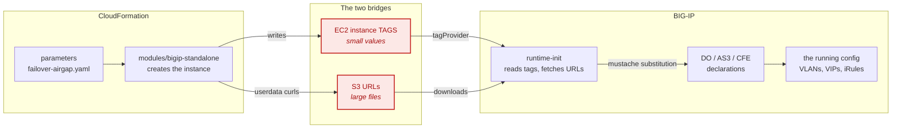
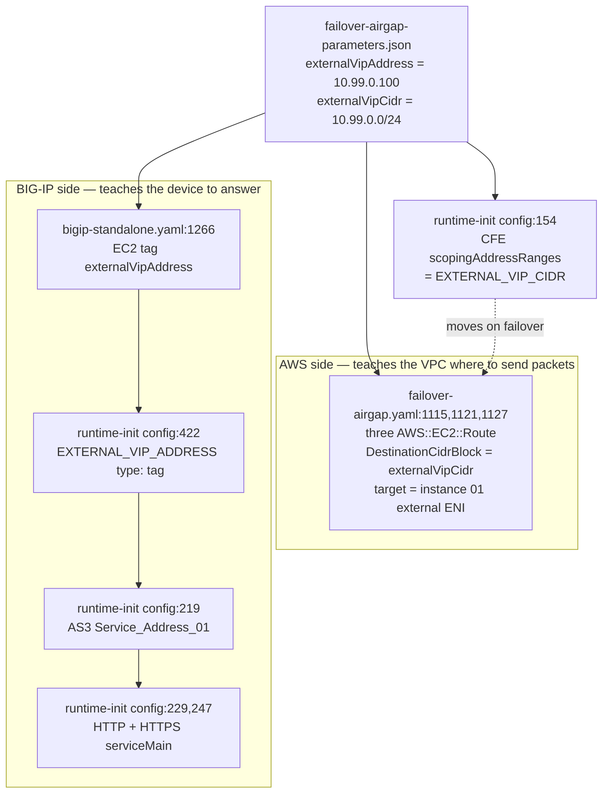
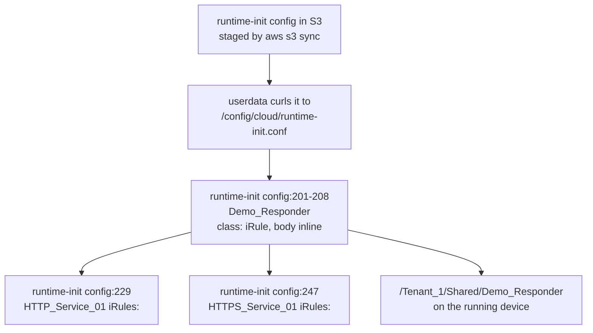
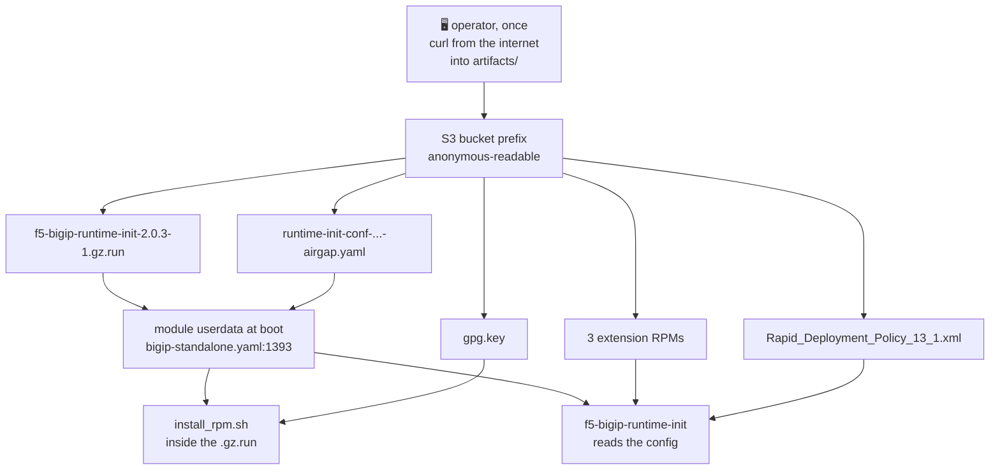
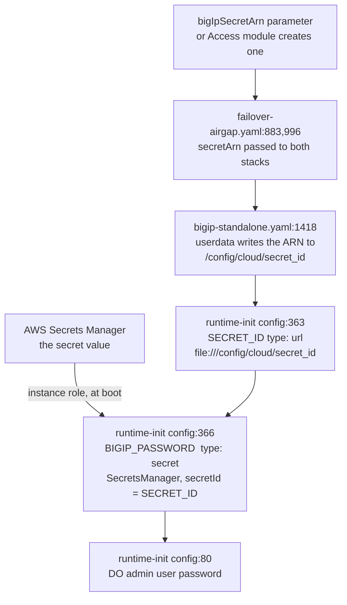
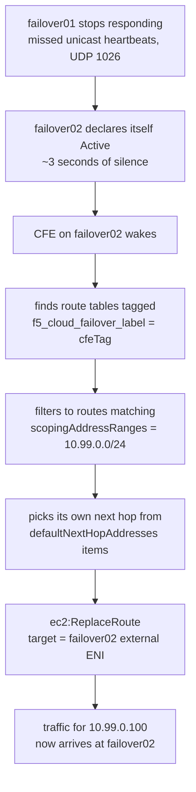
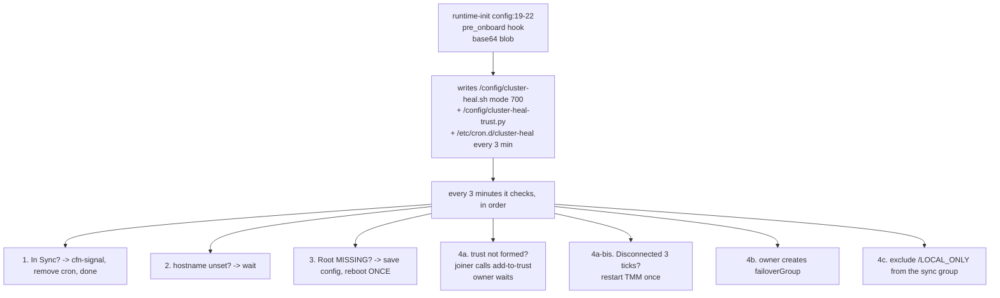

# How this template actually works — a dependency map

**Who this is for.** An engineer or customer who can read the deployment guide and follow it,
but wants to know *why* it works: where a value enters, what carries it, and what finally
consumes it. It exists because this solution spans three systems that do not talk to each other
directly, and almost every confusing failure turns out to be a break in the handoff between them.

**How to use it.** [Section 1](#1-three-worlds-two-bridges) is the mental model — read it once and
the rest follows. Sections 2 to 7 are **traces**: each answers one concrete question by following
a value end to end, with exact `file:line` references so you can open the source and see it. The
[symptom index](#8-symptom-index) at the end maps "this is broken" to the trace that explains it.

Line numbers are for the **3-NIC** resources, which is what this solution deploys. The 2-NIC and
1-NIC variants in `modules/bigip-standalone` repeat the same blocks further down the file.

---

## Contents

1. [Three worlds, two bridges](#1-three-worlds-two-bridges)
2. [Trace: how the VIP got built](#2-trace-how-the-vip-got-built)
3. [Trace: where the iRule came from](#3-trace-where-the-irule-came-from)
4. [Trace: how the artifacts reach the BIG-IP](#4-trace-how-the-artifacts-reach-the-big-ip)
5. [Trace: how the admin password travels](#5-trace-how-the-admin-password-travels)
6. [Trace: what actually happens during a failover](#6-trace-what-actually-happens-during-a-failover)
7. [Trace: how clustering bootstraps](#7-trace-how-clustering-bootstraps)
8. [Symptom index](#8-symptom-index)

---

## 1. Three worlds, two bridges

Nothing here is one system. It is three, and they cannot address each other:

| World | What it is | What it can do |
|---|---|---|
| **CloudFormation** | The templates, parameters, nested stacks | Create AWS resources. Cannot log into a BIG-IP or write a line of its config |
| **S3** | The staging bucket | Hold files. Serves anonymous HTTPS reads |
| **BIG-IP** | The two VEs | Configure themselves from a declaration. Cannot read a CloudFormation parameter |

They are joined by exactly **two bridges**, and every value in the solution crosses one of them:



**Bridge 1 — EC2 instance tags.** CloudFormation writes tags onto the instance; runtime-init
reads them back with a `tagProvider` and substitutes them into the declarations. This carries
every small value: the VIP address, the hostname, the peer's Self IP, the CFE bucket name.

**Bridge 2 — S3 URLs.** Anything too large to be a tag — the runtime-init installer, the three
extension RPMs, the WAF policy, the runtime-init config file itself — is staged in S3 and fetched
over anonymous HTTPS at boot.

> **This is the single most useful thing to understand.** When a value does not arrive on the
> BIG-IP, the break is almost always at a bridge: a tag that was never written, or a URL that was
> never reachable. Both are visible from the instance itself, which is why every trace below ends
> with a command you can run on a live box.

The substitution syntax is [mustache](https://mustache.github.io/): `{{{TAG_NAME}}}` in the
runtime-init config is replaced by the resolved value before the declaration is applied. The
triple braces mean "do not HTML-escape", which matters for URLs and passwords.

> ⚠️ **A mustache value in YAML must be quoted.** `url: {{{X}}}` is invalid YAML — a bare `{`
> opens a flow mapping. Every usage in these files is written `url: "{{{X}}}"` for that reason.

---

## 2. Trace: how the VIP got built

**The question:** I set `externalVipAddress` to `10.99.0.100`. How did that become a virtual
server on the BIG-IP, and how did AWS learn to route to it?

One parameter feeds **two independent chains** — the BIG-IP side and the AWS side. They must
agree, and the design makes them agree by deriving both from the same value.



| Step | File | Line | What happens |
|---|---|---|---|
| 1 | `failover-airgap-parameters.json` | — | You set the address and the prefix |
| 2 | `failover-airgap.yaml` | 1115, 1121, 1127 | Three `AWS::EC2::Route`, one per route table, for the **prefix** — initially pointed at instance 01's external ENI |
| 3 | `failover-airgap.yaml` | 822, 938 | Address and prefix passed into both BIG-IP nested stacks |
| 4 | `modules/bigip-standalone.yaml` | 1266, 1268 | Written as EC2 tags — **the bridge** |
| 5 | runtime-init config | 422, 427 | Read back as `EXTERNAL_VIP_ADDRESS` / `EXTERNAL_VIP_CIDR` |
| 6 | runtime-init config | 219 | Address substituted into AS3 `Service_Address_01` |
| 7 | runtime-init config | 229, 247 | Both virtual servers reference that service address |
| 8 | runtime-init config | 154 | Prefix substituted into CFE `scopingAddressRanges` |

**Why the address is an alien IP.** F5 (and AWS) call an address chosen deliberately outside
the VPC CIDR an *alien IP*. `10.99.0.100` belongs to no subnet, so it is not an
ENI address and nothing has to move it between AZs. Only the *route* moves. That is the entire
mechanism, and it is why this design needs no Elastic IP.

**Why every VIP in the alien prefix works for free.** Steps 2 and 8 use the **prefix**, not
the address. Any address inside `10.99.0.0/24` is already routed and already in CFE's scope — see the guide's
"Adding production VIPs after the demo".

**Check it on a live box:**

```bash
# ⚙️ BIG-IP — did the tag arrive, and did AS3 consume it?
curl -s -H "X-aws-ec2-metadata-token: $(curl -sX PUT http://169.254.169.254/latest/api/token \
  -H 'X-aws-ec2-metadata-token-ttl-seconds: 60')" \
  http://169.254.169.254/latest/meta-data/tags/instance/externalVipAddress; echo
tmsh -c 'cd /; list ltm virtual recursive one-line' | grep -o 'destination [^ ]*'
```

---

## 3. Trace: where the iRule came from

**The question:** the demo page says "Served by failover01.local". Nothing in CloudFormation
mentions an iRule. Where is it defined and how did it get attached?

It is written **inline in the AS3 declaration**, inside the runtime-init config. There is no
separate file and nothing fetches it — it travels as text inside a file that is itself fetched.



| Step | File | Line | What happens |
|---|---|---|---|
| 1 | `failover-airgap.yaml` | 800, 916 | Derives the config URL from `s3BucketName` / `s3BucketRegion` / `artifactLocation` |
| 2 | `modules/bigip-standalone.yaml` | ~1400 | Userdata `curl`s it to `/config/cloud/runtime-init.conf` |
| 3 | runtime-init config | 201–208 | `Demo_Responder` declared as an AS3 `iRule` with the TCL inline |
| 4 | runtime-init config | 229, 247 | Referenced by both virtual servers via `use:` |

**Why it never needs removing.** The rule checks `active_members` on the pool and returns
immediately if any exist, so once a real back end is present it steps aside and traffic is load
balanced normally. It only answers when the pool is empty — which is the case with
`provisionExampleApp=false`.

**The consequence worth knowing.** Because it is AS3-declared, it lives under `Tenant_1` and AS3
owns it. Editing it in the GUI works until the next AS3 deployment silently reverts it. To change
it, edit the runtime-init config in your bucket and redeploy.

**Check it on a live box:**

```bash
# ⚙️ BIG-IP
tmsh -c 'cd /; list ltm rule recursive one-line' | cut -c1-80
grep -n "Demo_Responder" /config/cloud/runtime-init.conf
```

---

## 4. Trace: how the artifacts reach the BIG-IP

**The question:** the BIG-IPs have no internet. Where do the installer, the RPMs, the GPG key and
the WAF policy come from, and who fetches what?

Five files, three different fetchers, two different times. This is the trace with the most moving
parts and the one that produced the most failures during development.



| Artifact | Fetched by | Told where by | Notes |
|---|---|---|---|
| `f5-bigip-runtime-init-2.0.3-1.gz.run` | userdata `curl` | `bigIpRuntimeInitPackageUrl`, derived at `failover-airgap.yaml:787` | Auto-derives from the bucket parameters |
| `runtime-init-...-airgap.yaml` | userdata `curl` | `bigIpRuntimeInitConfig`, derived at `failover-airgap.yaml:800` | Becomes `/config/cloud/runtime-init.conf` |
| **`gpg.key`** | **`install_rpm.sh`**, not userdata | `--key`, built at `failover-airgap.yaml:794` and passed via `INSTALLER_FLAGS` | See the warning below |
| 3 extension RPMs | runtime-init | `extensionUrl` at runtime-init config 27, 31, 35, built from `ARTIFACT_BASE_URL` | Hash-pinned by `extensionHash` |
| WAF policy XML | AS3, during deployment | `url:` at runtime-init config 198, built from `ARTIFACT_BASE_URL` | Fetched by the BIG-IP, not by you |

> ⚠️ **`gpg.key` is the one that catches everyone.** It is not fetched by our templates at all —
> `install_rpm.sh`, *inside* the self-extracting installer, fetches its own GPG key to verify the
> RPM signature, and F5 hard-codes that to `https://f5-cft.s3.amazonaws.com/...`. Note the missing
> `us-gov`: that is a **commercial-partition** bucket, which a GovCloud S3 gateway endpoint does
> not serve and an air-gapped VPC cannot route to. The fetch is fatal and retries forever. This is
> why the template passes `--key` at a staged copy, and why `gpg.key` must be uploaded separately —
> `s3 sync` does not carry it, because it is not in the repository.

**The flag ordering matters.** `install_rpm.sh` parses `--telemetry-params` with an off-by-one
(`TELEMETRY_PARAMS=$2; shift` — consuming two words, shifting one), so anything positioned after
it is never parsed. Our flags are therefore emitted **before** it. See
`modules/bigip-standalone.yaml:1454`.

**Check it on a live box:**

```bash
# ⚙️ BIG-IP — which key did the installer actually use?
grep 'GPG PUB Key' /var/log/cloud/startup-script.log
# and did the extensions install from your bucket?
grep -E 'Installing|extensionUrl' /var/log/cloud/startup-script.log | head
```

`f5-cft.s3.amazonaws.com` in that first line means the `--key` flag did not reach the installer.

---

## 5. Trace: how the admin password travels

**The question:** the password is in Secrets Manager. The BIG-IP has no AWS CLI. How does it get
in, and why is it the same on both devices?

The password is never written into a template, a tag, or a file. Only the **ARN** travels; the
BIG-IP fetches the value itself using its instance role.



| Step | File | Line | What happens |
|---|---|---|---|
| 1 | `failover-airgap.yaml` | 697, 883, 996 | ARN passed to both BIG-IP stacks — created by the `Access` module if you left the parameter blank |
| 2 | `modules/bigip-standalone.yaml` | 1418 | Userdata writes the **ARN only** to `/config/cloud/secret_id` |
| 3 | runtime-init config | 363 | `SECRET_ID` read from that file (`type: url`, a `file://` URL) |
| 4 | runtime-init config | 366 | `BIGIP_PASSWORD` resolved from Secrets Manager using the instance IAM role |
| 5 | runtime-init config | 80 | Substituted into the DO `admin` user declaration |

**Why the same secret on both devices.** Both stacks receive the same ARN, so both resolve the
same value. That shared credential is also what device trust uses to authenticate the pair to
each other — which is why they must match, and why changing one device's password by hand breaks
clustering.

**Why a rejected password means onboarding never ran.** DO sets the password at step 5. If the
password is refused, the chain broke *before* that — almost always at the installer. Chasing
Secrets Manager is a dead end; check the hostname instead, per the guide's troubleshooting.

**Check it on a live box:**

```bash
# ⚙️ BIG-IP — the ARN is on disk, the password never is
cat /config/cloud/secret_id
grep -c 'BIGIP_PASSWORD' /config/cloud/runtime-init.conf
```

---

## 6. Trace: what actually happens during a failover

**The question:** the active device dies. Concretely, what moves, who moves it, and how does it
know where to move it to?

Nothing on the BIG-IPs changes. **One AWS route changes**, and CFE makes the API call.



| Input | Where it comes from | Line |
|---|---|---|
| `f5_cloud_failover_label` on the route tables | `failover-airgap.yaml` tags the three route tables | — |
| The same tag value in CFE | `cfeTag` param → `failoverTag` instance tag → `FAILOVER_TAG` | module 1260, config 383 |
| `scopingAddressRanges` | `externalVipCidr` → tag → `EXTERNAL_VIP_CIDR` | config 154 |
| `defaultNextHopAddresses` | `externalSelfIp` / `bigIpPeerExternalSelfIp` → tags → `OWN_SELF_IP_EXTERNAL` / `PEER_SELF_IP_EXTERNAL` | module 1272, 1274; config 442, 447 |
| CFE state store | `cfeS3Bucket` → `cfeStorageName` tag → `CFE_STORAGE_NAME` | module 1262, config 137 |
| Permission to call `ReplaceRoute` | The instance profile from the `Access` module, scoped by the same tag | `modules/access/access.yaml:971` |

> ⚠️ **The next-hop addresses must be bare, with no `/mask`.** CFE matches these against the
> device's own local addresses to decide which one is "its" next hop. A masked entry like
> `10.0.0.11/24` never matches, so that device silently performs **zero** route operations —
> while still reporting `taskState: SUCCEEDED`. This cost a full day to find. It is why
> `OWN_SELF_IP_EXTERNAL` is sourced from a dedicated tag rather than reused from
> `SELF_IP_EXTERNAL`, which carries the mask.

> ⚠️ **CFE reports success even when it does nothing.** Any monitoring must compare the **actual
> route target** against the **actual active device**, not CFE's own status. See the guide's
> section 9.

**Check it on a live box:**

```bash
# ⚙️ BIG-IP — watch a failover happen
tail -f /var/log/restnoded/restnoded.log | grep -i 'next hop\|route'
```

Want `Next hop address: 10.0.x.11` then `Route(s) updated successfully`. `Next hop address:
undefined` or `No route operations to run` means CFE did nothing.

```bash
# ⚙️ BIG-IP — the live next-hop list, which must be bare addresses
curl -su admin:<password> -X POST http://localhost:8100/mgmt/shared/cloud-failover/declare \
  -d '{"action":"discover"}' | python3 -m json.tool | grep -A4 defaultNextHopAddresses
```

---

## 7. Trace: how clustering bootstraps

**The question:** there is a base64 blob in the runtime-init config that turns into a shell script
and a cron job. Why does clustering need a shell script at all?

Because Declarative Onboarding's own clustering cannot bootstrap on this platform. BIG-IP 17.x has
a startup-timing defect where `/Common/Root`, the device trust domain, is not initialised on first
boot. DO's clustering then deadlocks — its joiner never runs `add-to-trust` even once Root exists.
F5's documented workaround is "reboot, then re-apply clustering by hand". `cluster-heal.sh`
automates exactly that.



| Step | File | Line | What happens |
|---|---|---|---|
| 1 | runtime-init config | 19–22 | `pre_onboard_enabled` hook, script carried as base64 |
| 2 | — | — | Writes the script, its Python helper and a `*/3` cron entry |
| 3 | `cluster-heal.sh` | 45 | If `In Sync`: send `cfn-signal`, delete cron, write `done`, stop |
| 4 | `cluster-heal.sh` | 73 | If `/Common/Root` missing: save config and reboot **once**, marker-gated |
| 5 | `cluster-heal.sh` | 92 | Joiner calls `add-to-trust` via `cluster-heal-trust.py`, which fetches the password from Secrets Manager with SigV4 — BIG-IP has no `boto3` |
| 6 | `cluster-heal.sh` | 159 | If sync stays `Disconnected` for 3 ticks: restart TMM once |
| 7 | `cluster-heal.sh` | 235 | Owner (alphabetically first) creates `failoverGroup` |
| 8 | `cluster-heal.sh` | 261 | Removes `/LOCAL_ONLY` from the sync group |

**Why `cfn-signal` comes from the script and not from userdata.** Because clustering is
bootstrapped out of band, runtime-init exits non-zero on the clustering declaration and its
userdata never sends the success signal. The script reuses the *same* rendered `cfn-signal`
command CloudFormation put in the userdata — no new AWS calls or permissions — so the stack
succeeds only when the pair is genuinely clustered.

**Why `/LOCAL_ONLY` must be excluded.** It holds the default route, whose gateway is the device's
own AZ gateway and therefore **differs per device**. If the folder is in the sync group, that route
is pushed to the peer, rejected there, and the cluster sits permanently in `Sync Failed`.

**Why it is base64.** The runtime-init config is YAML, and a shell script embedded as literal text
would be at the mercy of YAML quoting and indentation. Base64 makes it one opaque token. The cost
is that **the blob must be regenerated in all four config files after any edit to the script** —
`base64 -w0 cluster-heal.sh`.

**It disables itself.** Once the cluster is `In Sync` it writes `done` and removes its own cron. It
is a build-time bootstrap, not a running-cluster babysitter — which is why a device rejoining after
a stop needs a manual sync.

**Check it on a live box:**

```bash
# ⚙️ BIG-IP — the whole narration, one entry every 3 minutes
cat /config/cluster-heal/log
ls /config/cluster-heal/     # markers: rebooted, trust_tries, tmm_restarted, disc_ticks, signalled, done
```

---

## 8. Symptom index

| Symptom | Bridge that broke | Trace |
|---|---|---|
| Stack hangs ~50 min, admin password rejected, prompt is `ip-10-x-x-x` | S3 URL — the installer's GPG fetch | [4](#4-trace-how-the-artifacts-reach-the-big-ip) |
| Extensions fail to install, or install from the wrong bucket | S3 URL — `ARTIFACT_BASE_URL` | [4](#4-trace-how-the-artifacts-reach-the-big-ip) |
| Password refused but hostname **is** set | Not a bridge — DO ran; look at Secrets Manager and the instance role | [5](#5-trace-how-the-admin-password-travels) |
| VIP dark, cluster healthy | Route points at the wrong device | [2](#2-trace-how-the-vip-got-built), [6](#6-trace-what-actually-happens-during-a-failover) |
| Failover "succeeds" but the route never moves | Tag — masked next-hop address | [6](#6-trace-what-actually-happens-during-a-failover) |
| `UnauthorizedOperation` on `ReplaceRoute` | Instance profile or tag scoping | [6](#6-trace-what-actually-happens-during-a-failover) |
| GUI shows DO objects but no virtual servers | Neither — AS3 folders, or admin partition access | guide §5.1 |
| Cluster never forms, both devices Active | Neither — HA channel | [7](#7-trace-how-clustering-bootstraps), guide §11 |
| Permanent `Sync Failed` on a static route gateway | `/LOCAL_ONLY` in the sync group | [7](#7-trace-how-clustering-bootstraps) |
| A new VIP does not fail over | Address outside `externalVipCidr` | [2](#2-trace-how-the-vip-got-built) |

---

## Keeping this accurate

Line numbers drift. If you change a template, re-derive them:

```bash
# 🖥️ WORKSTATION — from the repository root
grep -n "Key: externalVipAddress" examples/modules/bigip-standalone/bigip-standalone.yaml
grep -n "^  - name: " examples/failover-airgap/bigip-configurations/runtime-init-conf-3nic-payg-instance01-airgap.yaml
```

The **structure** is stable — three worlds, two bridges, tags and URLs. Only the coordinates move.
